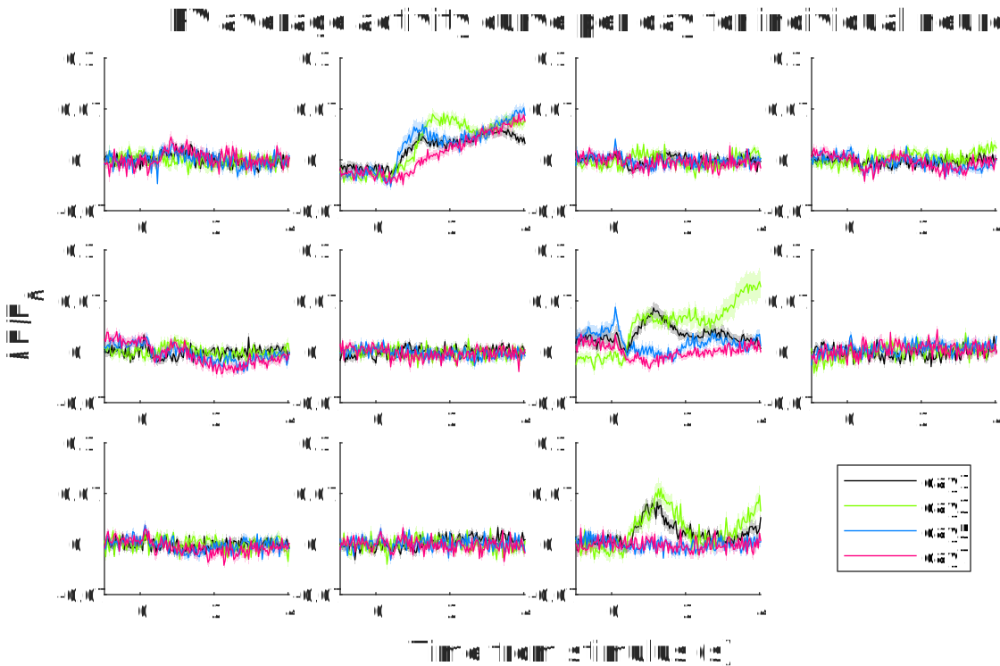

埃博拉酱的MATLAB扩展工具包，提供一系列MATLAB内置函数所欠缺，但却常用的增强功能

本项目的发布版本号遵循[语义化版本](https://semver.org/lang/zh-CN/)规范。开发者认为这是一个优秀的规范，并向每一位开发者推荐遵守此规范。
# 目录
本包中所有函数均在命名空间下，使用前需import。使用命名空间是一个好习惯，可以有效防止命名冲突，避免编码时不必要的代码提示干扰。
- [+MATLAB](#MATLAB)
	- [+Addons](#Addons) 本包用于开发人员管理发布包，以及用户查询包依赖项。
		- [GetRequirements](#GetRequirements) 获取包中包含的依赖项列表
		- [PublishRequirements](#PublishRequirements) 在包目录下生成一个依赖项.mat文件
	- [+DataFun](#DataFun)
		- [MaxSubs](#MaxSubs) 返回数组的最大值以及所在的坐标。
		- [MeanSem](#MeanSem) 一次性高效算出数据沿维度的平均值和标准误
		- [MinSubs](#MinSubs) 返回数组的最小值以及所在的坐标。
		- [Rescale](#Rescale) 数组元素沿指定维度的缩放范围
	- [+DataTypes](#DataTypes)
		- [@ArrayBuilder](#ArrayBuilder) 数组累加器类
		- [Cell2Mat](#Cell2Mat) cell2mat的升级版
		- [DimensionFun](#DimensionFun) 对数组按维度执行函数，支持单一维度隐式扩展和返回数组自动拼接
		- [FolderFun](#FolderFun) 取对一个文件夹下所有满足给定文件名模式的文件的绝对路径，对它们执行函数（仅限Windows）
		- [RepeatingFun](#RepeatingFun) 重复多次调用函数，为每个重复参数生成一个返回值
	- [+ElMat](#ElMat)
		- [OrderedDimensionSize2IndexArray](#OrderedDimensionSize2IndexArray) 根据维度顺序和尺寸，生成自定义的下标转线性索引数组
		- [OrderedDimensionSize2SubsVectors](#OrderedDimensionSize2SubsVectors) 根据维度顺序和尺寸，生成自定义的线性索引转下标向量
	- [+General](#General)
		- [Save](#Save) 内置save函数的强化版
		- [SHFileCopy](#SHFileCopy) 调用Windows文件资源管理器进行文件、目录复制操作，支持批量操作、显示进度、撤销、对话框等高级功能。（仅限Windows）
		- [SHFileDelete](#SHFileDelete) 调用Windows文件资源管理器进行文件、目录删除操作，支持批量操作、显示进度、撤销、对话框等高级功能。（仅限Windows）
		- [SHFileMove](#SHFileMove) 调用Windows文件资源管理器进行文件、目录移动操作，支持批量操作、显示进度、撤销、对话框等高级功能。（仅限Windows）
		- [StaticJavaPath](#StaticJavaPath) 确认Java路径已添加到静态路径列表
	- [+Graph2D](#Graph2D)
		- [MultiShadowedLines](#MultiShadowedLines) 带图例的多条误差阴影线图
	- [+Graph3D](#Graph3D)
		- [ColorAllocate](#ColorAllocate) 为白色背景下的作图分配合适的颜色。
	- [+Graphics](#Graphics)
		- [FigureAspectRatio](#FigureAspectRatio) 设置当前图窗的纵横比
	- [+ImageSci](#ImageSci)
		- [@OmeTiff](#OmeTiff) 支持XYCTZ五维索引的OME标准Tiff增强库
		- [SetLastDirectory](#SetLastDirectory) 跳转到最后一个IFD，并且返回该IFD的序号。
	- [+IOFun](#IOFun)
		- [DelimitedStrings2Table](#DelimitedStrings2Table) 将一列分隔符字符串的前几个字段读出为表格或时间表
		- [MatVariableRename](#MatVariableRename) 批量重命名.mat文件中的变量
		- [XmlDom2String](#XmlDom2String) 将org.w3c.dom.Document导出为XML文本
		- [XmlString2Dom](#XmlString2Dom) 将XML字符串解析为org.w3c.dom.Document类型
	- [+Lang](#Lang)
		- [DistributeVararginByValidation](#DistributeVararginByValidation) 根据验证函数将输入的Varargin分发到输出变量
		- [GetNthOutputs](#GetNthOutputs) 获取函数的第N个输出
	- [+Ops](#Ops)
		- [IsMember](#IsMember) 支持任意类型输入的ismember
		- [Unique](#Unique) 支持任意类型输入的unique
	- [+Parallel](#Parallel)
		- [@MmfSemaphore](#MmfSemaphore) 使用内存映射文件来模拟一个信号量，用于跨进程资源分配。
	- [+SpecFun](#SpecFun)
		- [LogicalExhaustion](#LogicalExhaustion) 穷举一定长度的所有可能的逻辑向量
		- [Subsets](#Subsets) 列出集合的所有子集
	- [+UITools](#UITools)
		- [OpenFileDialog](#OpenFileDialog) 可以设置初始目录，以及保存上次所在目录的文件打开对话框（仅限Windows）
		- [SaveFileDialog](#SaveFileDialog) 可以设置初始目录，以及保存上次所在目录的文件保存对话框（仅限Windows）
- [+MatlabShared](#MatlabShared)
	- [+SupportPkg](#SupportPkg) 一键获取MATLAB硬件支持包
		- [ClearCache](#ClearCache) 清除缓存的下载器文件
		- [InstallSupportPackages](#InstallSupportPackages) 安装下载好的支持包
		- [SupportPackageDownloader](#SupportPackageDownloader) 下载支持包下载器
# +MATLAB
## +Addons
本包用于开发人员管理发布包，以及用户查询包依赖项。
### 依赖版本结构体
要使用本包中的依赖版本管理工具，你的包目录下必须有一个Version函数，返回依赖版本结构体。

依赖版本结构体包含一个Me字段，存储本包的版本号。其它字段则为所有依赖包的包名。如果依赖包名有点号分割，则表示为点索引的次级结构体。例如你开发的包A.B版本1.0.0，依赖包C.D版本1.1.0、包C.E-2.2.0和包F-1.3.0，则你应当撰写一个A.B.Version函数，返回含有如下字段的结构体：
- Me(1,1)string="1.0.0"，本包的版本号
- C(1,1)struct，依赖包C.D和C.E共用的顶级限定名，为一个结构体，包含如下字段：
	- D(1,1)struct，至少包含一个字段Me(1,1)string="1.1.0"，为包C.D的版本号。也可以继续包含C.D自身的其它依赖项。可以在包C.D中也包含一个同构的Version函数，实现递归调用。
	- E(1,1)struct，类似于C.D依赖项，C.E也有一个Me字段为版本号"2.2.0"
- F(1,1)struct，至少包含一个字段Me(1,1)string="1.3.0"

A.B.Version函数代码示例：
```MATLAB
function V=Version
V.Me="1.0.0";
%假定这些依赖包也都包含Version函数，则可以进行递归调用
V.C.D=C.D.Version;
V.C.E=C.E.Version;
V.F=F.Version;
%假设还依赖一个包G不包含Version函数，则必须手动输入
V.G.Me="1.3.0";
```
### GetRequirements
获取包中包含的依赖项列表

如果包目录下有一个依赖项.mat文件，本函数将载入那个文件并将其中的RequirementTable返回。该文件记录了包发布时所有依赖项的版本信息。可由[PublishRequirements](#PublishRequirements)生成。

输入参数：PackageName(1,1)string，要查看依赖信息的包名，默认本包（EbolaChan.MatlabExtension）

返回值：RequirementTable(:,2)table，第1列Package，第2列Version，列出该包发布时所有依赖项和版本
### PublishRequirements
在包目录下生成一个依赖项.mat文件

本函数用于包开发人员。当包下含有返回[依赖版本结构体](#依赖版本结构体)的Version函数时，可以用本函数在同目录下生成一个"依赖项.mat"，保存版本依赖结构体的所有一级依赖项的当前版本。这样当你的包发布给用户后，用户可以用[GetRequirements](#GetRequirements)得到你的包发布时所有依赖项的版本，然后逐一下载安装所有的依赖项。

输入参数：PackageName(1,1)string，你的包名，需要在该包下包含Version函数，返回版本依赖结构体

返回值：RequirementTable(:,2)table，第1列Package，第2列Version，列出该包发布时所有依赖项和版本
## +DataFun
### MaxSubs
返回数组的最大值以及所在的坐标。

MATLAB自带的max函数只能返回多维数组最大值的线性索引。本函数一口气返回最大值以及多维坐标，方便易用
```MATLAB
%对于有多个最大值的数组，返回线性索引最小的那个位置的坐标：
[M,S1,S2]=MATLAB.DataFun.MaxSubs([9 9 1;1 4 4;9 8 9])
%{
M =

	9


S1 =

	1


S2 =

	1
%}
%还可以指定运算维度。如将一个3维数组的后两维求最大值和下标，则返回的最大值和下标都是沿第1维的向量，且只返回最大值在后两维的下标
[M,S2,S3]=MATLAB.DataFun.MaxSubs(rand(3,3,3),[2 3])
%坐标维度输出顺序与输入的指定Dimension有关
[M,S3,S2]=MATLAB.DataFun.MaxSubs(rand(3,3,3),[3 2])
```

**位置参数**

Data，必需，要寻找最大值的多维数组

Dimensions(1,:)uint8，可选，要取最大值的维度。返回值在这些维度上长度将为1，在其它维度上排列最大值。默认所有维度都参与运算，即返回单一标量作为整个数组的最大值，并按顺序返回该最大值各个维度的坐标。

**返回值**

Value(1,1)，最大值

[S1,S2, …, Sn]，最大值所在的位置中，线性索引最小的那个位置的坐标。每个返回值依次代表各维度的坐标。只包含Dimensions维度的坐标，并按照Dimension指定的顺序排列输出。
### MeanSem
一次性高效算出数据沿维度的平均值和标准误。

具体算法：
$$S=\sum x$$
$$Mean=\frac{S}{N}$$
$$SEM=\frac{\sqrt{\sum{x^2}-S\cdot Mean}}{N}$$
```MATLAB
[Mean,SEM]=MeanSem([0 6 3;8 7 6;9 7 1],1)
%{
Mean =

    5.6667    6.6667    3.3333


SEM =

    2.3254    0.2722    1.1863
%}
[Mean,SEM]=MeanSem([0 6 3;8 7 6;9 7 1])
%{
Mean =

    5.2222


SEM =

    0.9910
%}
```
**输入参数**

Data，数据数组

Dimensions，可选，聚合维度。输出的Mean和SEM，其Dimensions维度上长度为1，其它维度上长度与Data相同。默认所有维度，此时Mean和SEM为全局平均数和标准误标量。

**返回值**

Mean double，沿维度的平均值

SEM double，沿维度的标准误
### MinSubs
返回数组的最小值以及所在的坐标。

MATLAB自带的min函数只能返回多维数组最小值的线性索引。本函数一口气返回最小值以及多维坐标，方便易用
```MATLAB
%对于有多个最小值的数组，返回线性索引最小的那个位置的坐标：
[M,S1,S2]=MATLAB.DataFun.MinSubs([9 9 1;1 4 4;9 8 9])
%{
M =

     1


S1 =

     2


S2 =

     1
%}
%还可以指定运算维度。如将一个3维数组的后两维求最小值和下标，则返回的最小值和下标都是沿第1维的向量，且只返回最小值在后两维的下标
[M,S2,S3]=MATLAB.DataFun.MinSubs(rand(3,3,3),[2 3])
%坐标维度输出顺序与输入的指定Dimension有关
[M,S3,S2]=MATLAB.DataFun.MinSubs(rand(3,3,3),[3 2])
```
**位置参数**

Data，必需，要寻找最小值的多维数组

Dimensions(1,:)uint8，可选，要取最小值的维度。返回值在这些维度上长度将为1，在其它维度上排列最小值。默认所有维度都参与运算，即返回单一标量作为整个数组的最小值，并按顺序返回该最小值各个维度的坐标。

**返回值**

Value(1,1)，最小值

[S1,S2, …, Sn]，最小值所在的位置中，线性索引最小的那个位置的坐标。每个返回值依次代表各维度的坐标。只包含Dimensions维度的坐标，并按照Dimension指定的顺序排列输出。
### Rescale
数组元素沿指定维度的缩放范围

MATLAB内置rescale函数不能指定维度，只能在整个数组范围内缩放。本函数解决该问题，允许指定Dimensions参数为运算维度。
```MATLAB
import MATLAB.DataFun.Rescale
%将整个数组缩放到[0,1]范围
Data=rand(4,4,4,4)*10;
%指定缩放维度范围。维度范围[2 4]意味着，以1×4×1×4数组为单位，在这4×1×4×1个数组内部分别进行缩放。
Rescale(Data,[2 4]);
%指定缩放范围[2,3]
Rescale(Data,2,3);
%同时指定缩放范围和维度范围
Rescale(Data*10,2,3,[2 4]);
```
**用法**
```MATLAB
import MATLAB.DataFun.Rescale
Rescale(Array);
Rescale(Array,Dimensions);
Rescale(Array,LowerBound,UpperBound);
Rescale(Array,LowerBound,UpperBound,Dimensions);
```
Array，必需，数值数组

LowerBound(1,1)，缩放下界

UpperBound(1,1)，缩放上界

Dimensions(1,:)，维度范围

**返回值**

Array，缩放后的数组
## +DataTypes
### @ArrayBuilder
数组累加器类

将数据向内存中积累时，经常遇到需要不断累加数组的问题，MATLAB会提示预分配内存。但如果读取之前无法得知将会有多少项，预分配就会变成一个十分麻烦的动态任务。本类建立一个增长维度，在此维度上可以不断累加一个内置的数组。用户只需不断Append即可，无需考虑内存分配的问题，本类会自动进行优化的内存管理。
```MATLAB
%构造一个沿第1维度累加的数组
Ab=MATLAB.DataTypes.ArrayBuilder(1);
%重复累加
for a=1:3
  Ab.Append(randi([0 9],randi([0 3]),3));
end
Ab.Harvest
%继续累加
for a=1:3
  Ab.Append(randi([0 9],randi([0 3]),3));
end
Ab.Harvest
%{
ans =

	8     3     4
	8     2     9
	0     8     1
	1     1     8
	5     8     3
	1     6     5


ans =

	8     3     4
	8     2     9
	0     8     1
	1     1     8
	5     8     3
	1     6     5
	0     2     1
	//数据随机生成，每次运行可能不同
%}
```

构造参数：BuildDimension(1,1)uint8=1，累加维度。数组的这个维度将不断累加增长，其它维度将由第一次Append决定，以后不再改变。

**只读属性**

BuildDimension(1,1)uint8，累加维度

**成员方法**

`Append`

向数组累加新内容

输入参数：New，要累加的内容。第一次可以累加任意内容，以后累加内容可以和第一次在累加维度上尺寸不一致，其它维度必须尺寸一致。

`Harvest`

收获累加完毕的MATLAB数组。收获后可以释放本对象，也可以继续累加。

返回值：Array，累加完毕的MATLAB数组。

`Clear`

清空储藏，从零开始重新累加，而不必新建对象重新分配内存，具有较高的性能。
### Cell2Mat
cell2mat的升级版

本函数是cell2mat的升级版，使用前请先参阅cell2mat函数文档，了解其功能和局限性。

cell2mat是一个功能十分强大的MATLAB函数，可以将元胞数组内的数组提取出来，拼成一个大数组，而且这些数组的尺寸不必完全相同，例如可以支持以下拼接：


但它也存在局限性。首先，只支持数值、逻辑、结构体、字符的拼接，其它常见数据类型（字符串、元胞、类对象）都无法使用。其次。对于以下结构，虽然尺寸恰好合适，但也无法拼接：


这是因为cell2mat默认先拼第1维，自然会遇到尺寸不匹配的问题。但我们可以看到，只要先拼第2维，就可以得到1×3和2×3两个矩阵，然后第1维就可以拼接了。本函数不仅支持各种数据类型，还会自动尝试从不同的维度进行拼接，因此支持更多复杂的结构。

输入参数：Cells cell，要拼接的元胞数组，各元胞内含有数据类型一致的数组，且各维尺寸上恰好可以拼接成一个大数组，维度不限。

返回值：拼接好的大数组
### DimensionFun
对数组按维度执行函数，支持单一维度隐式扩展和返回数组自动拼接

对数组进行批处理是十分常用的操作。但是arrayfun和cellfun只能进行按元素运算，不能按行、按列甚至按平面运算，而且不支持单一维度隐式扩展，如果返回值不是标量还不能自动拼接。采用本函数可以实现按任意维度运算，且支持单一维度隐式扩展，返回数组自动拼接。
```MATLAB
import MATLAB.DataTypes.DimensionFun
import MATLAB.DataTypes.CatMode
%% 图像拼接-1
%本示例将一系列宽度相同的图片纵向拼接成一张长图。假设ImagePaths是一个包含了待拼接图像路径的列向量
imshow(DimensionFun(@imread,ImagePaths,CatMode=CatMode.Linear));
%由于ImagePaths是向量，且imread返回uint8数值类型，因此以下写法也是等效的：
imshow(DimensionFun(@imread,ImagePaths,CatMode=CatMode.Linear));
%% 图像拼接-2
%同样是拼接图象，如果ImagePaths是一个待拼接的子图路径的矩阵呢？同样可以按照这个矩阵对这些图像自动进行二维拼接！
imshow(DimensionFun(@imread,ImagePaths,CatMode=CatMode.CanCat));
%% 异形数组拼接
A={1 [2 3]
[4 5] 6}
%此元胞数组直接使用cell2mat拼接会报错，但可以使用本函数拼接：
C=DimensionFun(@cell2mat,A);
%此示例仅用于展示DimensionFun的拼接功能，实际上可以直接使用SuperCell2Mat(A)一步到位。本函数实际上也是调用该函数实现的。
%% 序列采样-拆分打包与隐式扩展的相互作用展示
Sequence=1:10;
Start=(1:5)';
End=(6:10)';
disp(DimensionFun(@(Sequence,Start,End)Sequence(Start:End),Sequence,Start,End,SplitDimensions=1,CatMode=CatMode.Linear));
%输出
%     1     2     3     4     5     6
%     2     3     4     5     6     7
%     3     4     5     6     7     8
%     4     5     6     7     8     9
%     5     6     7     8     9    10
%注意，由于SplitDimensions仅为第1维，因此具有单一第1维的Sequence发生了隐式扩展，而具有单一第2维的Start和End未发生隐式扩展，而是直接打包交付给Function运算。
```
**位置参数**

Function(1,1)function_handle，必需，要执行的函数。必须接受等同于Arguments重复次数的参数

Arguments，重复，输入参数数组。输入的数组个数必须等于Function所能接受的输入值个数。所有数组各维度尺寸要么相等，要么为1，不允许各不相同的维度尺寸。不允许输入表格或其它非MATLAB标准数组，请始终先转化为MATLAB数组或元胞数组。

**名称值参数**

*以下两个参数只能选择其中一个进行指定*

另一个将会自动计算得出。如果两个参数都不指定，将把第一个Arguments所有非单一维度视为SplitDimensions，其它维度作为PackDimensions。

PackDimensions(1,:)uint8，将每个Arguments数组的指定维度打包，在其它维度（即SplitDimensions）上拆分，分别交付给Function执行

SplitDimensions(1,:)uint8，在每个Arguments数组的指定维度上拆分，将其它维度（即PackDimensions）打包，分别交付给Function执行

注意，拆分-打包步骤在隐式扩展之前。也就是说，由于PackDimensions指定的维度被包入了同一个元胞当中，尺寸恒为1，即使不同数组间这些维度具有不同的尺寸，也不会进行隐式扩展。隐式扩展仅在SplitDimensions中进行。

*以下两个参数可任意指定或不指定*

CatMode(1,1)MATLAB.DataTypes.CatMode=MATLAB.DataTypes.CatMode.CanCat，返回值拼接选项，根据Function的返回值设定，必须为以下四者之一：
- Scalar，Function的返回值为标量，将调用arrayfun完成拼接。
- Linear，SplitDimensions为标量，且Function的返回值为类型、PackDimensions维度上尺寸均相同的数组。将调用cat完成拼接。
- EsNlcs，Function的返回值为数值、逻辑、字符或字段相同的结构体数组，且尺寸完全相同。将调用cell2mat完成拼接。
- CanCat，Function的返回值为数组，允许尺寸不同，但最终可以拼接成一整个大数组。将调用MATLAB.DataTypes.Cell2Mat完成拼接。
- DontCat，不符合上述任何条件，或返回值为函数句柄。将不会拼接，返回元胞数组。

无论何种情况，都可以设为DontCat；其它选项都必须满足特定条件（对Function的每个返回值）。此外若Function的任何一个返回值是函数句柄，都只能选择DontCat。对于任何可拼接的情况，选择CanCat都能完成拼接，但性能最低。如果您确定您的函数返回值可以满足更苛刻的条件，应尽量优先选择Scalar>Linear>EsNlcs>CanCat。

Warning(1,1)logical=true，如果输入参数只有一个且为空，Function将不会被调用，因而无法获知返回值的数据类型，可能会与输入参数不为空的情况出现不一致的情形。该参数指定这种情况下是否要显示警告。

**返回值**

返回值为由Function的返回值按其所对应的参数在数组中的位置拼接成的数组。如果Function具有多个返回值，则每个返回值各自拼接成数组，作为本函数的多个返回值。根据CatMode不同：
- Scalar，返回数组，尺寸与每个Arguments在SplitDimensions上隐式扩展后的尺寸相同，PackDimensions上尺寸为1
- Linear & EsNlcs & CanCat，返回数组，该数组由返回值在SplitDimensions维度上的拼接得到
- DontCat，返回元胞数组，尺寸与每个Arguments在SplitDimensions上隐式扩展后的尺寸相同，元胞里是对应位置的Arguments输入Function产生的返回值。PackDimensions上尺寸为1。
### FolderFun
取对一个文件夹下所有满足给定文件名模式的文件的绝对路径，对它们执行函数
```MATLAB
import MATLAB.DataTypes.FolderFun
%显示当前文件夹下所有文件
FolderFun(@disp);
%显示用户选取的文件夹下所有.mlx文件
All=FolderFun(@deal,uigetdir,Filename="*.mlx")
```
**位置参数**

Function(1,1)function_handle，必需，要执行的函数句柄。必须接受1个文件路径作为输入参数。

Directory(1,1)string=""，可选，要遍历的文件夹路径，默认当前目录。如果不指定或设为空字符串，交给Function的路径参数将是相对于当前目录的相对路径；否则将是绝对路径。

**名称值参数**

Filename(1,1)string="*"，要筛选出的文件名模式，默认所有文件

UniformOutput(1,1)logical=true，是否将输出值直接拼接成向量。若false，则将每个输出值套上一层元胞以后再拼接成向量。如果Function返回的不是标量，必须设为false。

**返回值**

每个文件路径执行函数后的返回值列向量。如果Function有多个返回值，则返回同样多个列向量，每个元素对应位置都是对一个文件调用Function产生的返回值。根据UniformOutput的设定，这些元素有可能还会套在一层元胞里。
### RepeatingFun
重复多次调用函数，为每个重复参数生成一个返回值
```MATLAB
[One,Two,Three]=MATLAB.DataTypes.RepeatingFun(@zeros,1,2,3)
%{
One =

	0


Two =

	0     0
	0     0


Three =

	0     0     0
	0     0     0
	0     0     0
%}
```
**输入参数**

Function(1,1)function_handle，必需，要调用的函数句柄

Arguments，重复，每次调用的输入参数

**返回值**

varargout，每个重复输入的参数按顺序生成的返回值
## +ElMat
### OrderedDimensionSize2IndexArray
根据实际维度顺序和尺寸，生成自定义的下标转线性索引数组

一个数组的维度顺序可以用permute轻易调整。但当这个数组以非标准格式线性排列存储于巨大文件中时，你可能无法将这个文件整个读入内存再操作，而是只能将你的标准下标转换为线性索引，然后访问文件的特定部分。

本函数生成一个数组。你可以用标准下标顺序访问这个数组的元素得到文件的线性索引，并且可以适应不同的维度顺序。

本函数生成的线性索引数组实际上类似于[OrderedDimensionSize2SubsVectors](#OrderedDimensionSize2SubsVectors)的反向操作符，即将下表转换为线性索引。但本函数不是它的反函数，因为参数列表完全相同，而且同样支持自定义维度顺序。

现假设有一个数据集存储了五维图像数据，分别为宽度（X轴）、高度（Y轴）、多通道（C轴）、多深度（Z轴）、多时间点（T轴）。像素值在文件中是线性排列的，但文件头中定义了各轴的排列顺序和各轴尺寸：
```MATLAB
%% 示例1
Fid=fopen('示例数据.bin','r');
%读入维度顺序。这个维度顺序由XYCZT五个字符的排列来描述。例如YXTZC,YTZXC,都是可能的维度顺序。维度顺序的表示法是Little-endian的，即较低的维度在前，较高维度在后。
ActualOrder=fread(Fid,5,'char=>char')
%读入各维尺寸
DimensionSize=fread(Fid,5,'uint8=>uint8');
%文件中的维度顺序是运行时才知道的，编码时无从得知。为了方便后续处理，我们需要将维度顺序化归一致。这里使用YXCTZ作为标准维度顺序。
IndexArray=MATLAB.ElMat.OrderedDimensionSize2IndexArray(DimensionSize,false,ArbitraryOrder='YXCTZ',ActualOrder=ActualOrder);
%读入数据主体：
Data=fread(Fid,Inf,'uint8=>uint8');
%假设现在我们要取Y=1,X=2,C=3,T=4,Z=5处的数据，则可以：
Data(IndexArray(1,2,3,4,5))
%IndexArray将你的下标转换为文件数据的线性索引。这种转换仅仅是一个数组索引操作，具有较高的性能。
%本例中IndexArray和Data占据相同的内存，这是因为Data的维度顺序是完全未知的。实际上对于图像数据，前两维往往都是YX。在这个知识的帮助下，我们可以缩减IndexArray的尺寸：
Data=reshape(Data,DimensionSize(1),DimensionSize(2),[]);
IndexArray=MATLAB.ElMat.OrderedDimensionSize2IndexArray(DimensionSize(3:5),false,ArbitraryOrder='CTZ',ActualOrder=ActualOrder(3:5));
%已知前两维是YX，那么只有后三维未知，需要进行索引转换。于是假设现在我们要取C=3,T=2,Z=1处的图像帧：
imshow(Data(:,:,IndexArray(3,2,1)));
fclose(Fid);
%% 示例2
% 另一种情况是，虽然维度顺序是未知的，但各维尺寸对应的维度是已知的，而并非对应着文件中未知的维度顺序。
function GetData(Data,ActualOrder,SizeC,SizeT,SizeZ,C,T,Z)
arguments
	Data(:,:,:)uint8
	ActualOrder(1,3)char
	SizeC(1,1)uint8
	SizeT(1,1)uint8
	SizeZ(1,1)uint8
	C(1,1)uint8
	T(1,1)uint8
	Z(1,1)uint8
end
%本例中数据集实际维度顺序仍然未知，由用户输入决定；但是用户并未给出对应实际维度顺序的各维尺寸，而是作为具有实际意义的变量输入，即各维尺寸对应的维度是已知的：你只能按照一个任意的顺序将这些尺寸进行排列。
IndexArray=MATLAB.ElMat.OrderedDimensionSize2IndexArray([SizeC,SizeT,SizeZ],true,ArbitraryOrder='CTZ',ActualOrder=ActualDimensionOrder);
%注意到第2个参数使用了true，表示各维尺寸是按照编码时任意指定的顺序，而非ActualOrder排列的。这样得到的IndexArray仍然能按照上例相同的方法使用：
imshow(Data(:,:,IndexArray(C,T,Z)));
end
```
上述示例中，生成的索引数组只被使用了少数次数，相比于计算该数组的开销来说，性能上是不划算的，不如直接简单用ismember重排下标，再用sub2ind转线性索引。但如果索引取值操作需要被大量重复使用，提前计算出一个索引数组性能较高，相当于两次索引解决问题，远快于每次调用这些具有复杂逻辑的函数。

**位置参数**

DimensionSize(1,:)uint32，必需，各维度尺寸

DSOrderArbitrary(1,1)logical=true，可选，DimonsionSize的排列顺序是否是任意指定的。若true，表示DimensionSize的维度顺序以ArbitraryOrder为准；否则以ActualOrder为准。

**名称值参数**

以下两个参数若仅指定其一，则必须为数值向量；否则可以为任意类型：

ActualOrder(1,:)=1:numel(DimensionSize)，源数组实际的维度顺序。数组元素是任意的，只要每个元素在ArbitraryOrder中也都有出现即可。

ArbitraryOrder(1,:)=1:numel(DimensionSize)，希望得到的索引矩阵的维度顺序。数组元素是任意的，只要每个元素在ActualOrder中也都有出现即可。

**返回值**

ActualIndexArrayByWantSubs uint32，线性索引数组。用下标定位该数组中的某些元素后，这些元素就对应着源数组在该下标处的线性索引。
### OrderedDimensionSize2SubsVectors
根据维度顺序和尺寸，生成自定义的线性索引转下标向量

一个数组的维度顺序可以用permute轻易调整。但当这个数组以非标准格式线性排列存储于巨大文件中时，你可能无法将这个文件整个读入内存再操作，而是只能将线性索引转换为有意义的下标，然后再做下标特定的操作。

本函数为每个下标维度生成一个向量。例如生成X Y Z三个维度向量，则X向量在位置I处的值表示线性索引I对应的X下标。这类似于ind2sub，但ind2sub不能假定线性索引是完全按顺序排列的，所以要付出一些性能代价，此外也不支持维度重排。

本函数生成的下标向量实际上类似于OrderedDimensionSize2IndexArray的反向操作符，即将线性索引转换为下标。但本函数不是它的反函数，因为参数列表完全相同，而且同样支持自定义维度顺序。示例在[那个函数的文档](#OrderedDimensionSize2IndexArray)中。

**位置参数**

DimensionSize(1,:)uint32，必需，各维度尺寸

DSOrderArbitrary(1,1)logical=true，可选，DimonsionSize的排列顺序是否是任意指定的。若true，表示DimensionSize的维度顺序以ArbitraryOrder为准；否则以ActualOrder为准。

**名称值参数**

以下两个参数若仅指定其一，则必须为数值向量；否则可以为任意类型：

ActualOrder(1,:)=1:numel(DimensionSize)，源数组实际的维度顺序。数组元素是任意的，只要每个元素在ArbitraryOrder中也都有出现即可。

ArbitraryOrder(1,:)=1:numel(DimensionSize)，希望得到的索引矩阵的维度顺序。数组元素是任意的，只要每个元素在ActualOrder中也都有出现即可。

**返回值**

\[S1,S2,S3, …\]\(1,:\)uint32，下标向量。例如Sk向量在位置I处的值，表示线性索引I对应的第k维下标。
## +General
### Save
内置save函数的强化版

内置save函数只能保存工作区变量，且输入的是变量名称字符串，不能保存临时计算值，而且还有限制不能在parfor循环中使用。本函数取消这些限制，允许你使用最直观的方法保存变量！
```MATLAB
%如下代码生成4个.mat文件，每个文件内保存两个变量：No，表示该文件的编号；Rand，一个随机数
parfor No=1:4
	NoS=No+1;
	MATLAB.General.Save(No,NoS,'Rand',rand,'No',No);
	%将parfor索引作为文件名，保存工作区变量NoS，一个随机数保存为Rand，以及索引变量No本身。注意工作区变量NoS无需前置变量名，但parfor索引必须前置变量名
end
%注意到，本函数允许你直接输入工作区变量进行保存，而不是变量名字符串；对于计算得到的临时值，也可以在前面指定一个字符串作为它的变量名
%但是，parfor索引是个重要的例外：它的变量名在运行时会被优化掉，所以必须手动指定
```

*输入参数*

MatPath(1,1)string，必需，保存到的文件路径

Variable，重复，要保存的变量。如果是工作区变量，可以直接输入变量本身，无需提供变量名字符串，程序会自动检测；如果是计算临时生成的变量或parfor索引，则必须输入为变量名字符串-变量值对组。
### SHFileCopy
调用Windows文件资源管理器进行文件、目录复制操作，支持批量操作、显示进度、撤销、对话框等高级功能。

MATLAB自带的copyfile功能十分简陋，一次只能操作一个或具有通配符的一系列文件；不能显示进度；复制后无法撤销；覆盖文件也没有确认对话框等。本函数调用Windows文件资源管理器的强大功能实现完善的文件、目录复制操作。
```MATLAB
import MATLAB.General.*
%如下代码将5个文件分别复制到5个不同的文件夹并各自重命名，一次性批量完成操作。
From=["D:\OneDrive - 翁悸会\壁纸\(1).png"
"D:\OneDrive - 翁悸会\壁纸\(2).png"
"D:\OneDrive - 翁悸会\壁纸\(3).png"
"D:\OneDrive - 翁悸会\壁纸\(4).png"
"D:\OneDrive - 翁悸会\壁纸\(5).png"];
To=["C:\Users\vhtmf\Pictures\1\1.png"
"C:\Users\vhtmf\Pictures\2\2.png"
"C:\Users\vhtmf\Pictures\3\3.png"
"C:\Users\vhtmf\Pictures\4\4.png"
"C:\Users\vhtmf\Pictures\5\5.png"];
%使用bitor组合不同的旗帜。这里指定了撤销功能和多目的地功能。
%因为5个目标文件夹不存在，将会弹出对话框询问用户是否要创建这些文件夹。如果用户都选了是，则操作成功。
[ErrorCode,AnyOperationsAborted] = SHFileCopy(From,To,bitor(FILEOP_FLAGS.FOF_ALLOWUNDO,FILEOP_FLAGS.FOF_MULTIDESTFILES))
%收集返回值，ErrorCode为0说明操作成功，AnyOperationsAborted为false说明用户没有通过对话框取消操作。
%虽然文件被复制到了各不相同的目录下，但仍可以在文件资源管理器中右击呼出上下文菜单，撤销本次复制操作。
%撤销以后，再尝试执行如下代码：
To="C:\Users\vhtmf\Pictures";
[ErrorCode,AnyOperationsAborted] = SHFileCopy(From,To)
%所有文件都被复制到了同一个目录下，且没有被重命名。虽然没有指定旗帜，该操作仍然可以在文件资源管理器中撤销，因为本函数在调用方不指定旗帜时默认允许撤销。如果不允许撤销，请将旗帜设为0。
%撤销以后，再尝试执行如下代码：
From="D:\OneDrive - 翁悸会\壁纸";
[ErrorCode,AnyOperationsAborted] = SHFileCopy(From,To)
%整个目录都被复制了。
```
**输入参数**

From(:,1)string，必需，所有要复制的源文件、目录。可以同时指定多个文件或目录，不需要在同一个目录下，并且可以使用通配符。

To(:,1)string，必需，复制的目标。如果指定为标量，将把所有文件、目录复制到该字符串所指定的目录下；若目录不存在，可以自动创建。如果指定为向量，则必须和From具有相同的尺寸，每个文件、目录进行一一对应的复制；并且需要指定MATLAB.General.FILEOP_FLAGS.FOF_MULTIDESTFILES旗帜。

Flags(1,1)uint16=MATLAB.General.FILEOP_FLAGS.FOF_ALLOWUNDO，可选，功能旗帜。[FILEOP_FLAGS](+MATLAB/+General/FILEOP_FLAGS.m)中定义了可选的附加功能。这些功能可以通过bitor进行组合，同时启用。如果不希望指定任何附加功能，请将该值显式设为0。

**返回值**

ErrorCode(1,1)int32，错误代码。如果操作成功，返回0；否则返回一个特定的代码。代码对应的错误说明，请查阅[winerror.h](+MATLAB/+General/winerror.h)。

AnyOperationsAborted(1,1)logical，指示是否有操作被用户取消。
### SHFileDelete
调用Windows文件资源管理器进行文件、目录删除操作，支持批量操作、显示进度、撤销、对话框等高级功能。

MATLAB自带的delete和rmdir功能十分简陋，一次只能操作一个或具有通配符的一系列目标；delete只能删文件，rmdir只能删目录；不能显示进度；只能永久删除，不能送进回收站，无法撤销，误操作后果难以挽回；永久删除也没有确认对话框等。本函数调用Windows文件资源管理器的强大功能实现完善的文件、目录删除操作。
```MATLAB
import MATLAB.General.SHFileDelete
%如下代码一口气同时删除2个目录和2个文件
From=["C:\Users\vhtmf\Pictures\1"
"C:\Users\vhtmf\Pictures\2"
"C:\Users\vhtmf\Pictures\986e34d724621831601658c5b8cb89.png"
"C:\Users\vhtmf\Pictures\Konachan.com%20-%20326560%20berryverrine%20breasts%20chinese_clothes%20chinese_dress%20cleavage%20dress%20glasses%20horns%20original%20polychromatic%20purple_hair%20red_hair.jpg"];
[ErrorCode,AnyOperationsAborted] = SHFileDelete(From)
%收集返回值，ErrorCode为0说明操作成功，AnyOperationsAborted为false说明用户没有通过对话框取消操作。
%虽然文件被删除，但并非永久，可以在回收站中恢复，也可以在文件资源管理器中右击呼出上下文菜单，撤销本次删除操作。
%显式指定Flags为0，会将目录和文件永久删除无法恢复，请谨慎使用：
[ErrorCode,AnyOperationsAborted] = SHFileDelete(From,0)
```
**输入参数**

From(:,1)string，必需，所有要删除的文件、目录。可以同时指定多个文件或目录，不需要在同一个目录下，并且可以使用通配符。

Flags(1,1)uint16=MATLAB.General.FILEOP_FLAGS.FOF_ALLOWUNDO，可选，功能旗帜。[FILEOP_FLAGS](+MATLAB/+General/FILEOP_FLAGS.m)中定义了可选的附加功能。这些功能可以通过bitor进行组合，同时启用。如果不希望指定任何附加功能，请将该值显式设为0。

**返回值**

ErrorCode(1,1)int32，错误代码。如果操作成功，返回0；否则返回一个特定的代码。代码对应的错误说明，请查阅[winerror.h](+MATLAB/+General/winerror.h)。

AnyOperationsAborted(1,1)logical，指示是否有操作被用户取消。
### SHFileMove
调用Windows文件资源管理器进行文件、目录移动操作，支持批量操作、显示进度、撤销、对话框等高级功能。

MATLAB自带的movefile功能十分简陋，一次只能操作一个或具有通配符的一系列文件；不能操作目录；不能显示进度；移动后无法撤销；覆盖文件也没有确认对话框等。本函数调用Windows文件资源管理器的强大功能实现完善的文件、目录移动操作。
```MATLAB
import MATLAB.General.*
%如下代码将5个文件分别移动到5个不同的文件夹并各自重命名，一次性批量完成操作。
From=["D:\OneDrive - 翁悸会\壁纸\(1).png"
"D:\OneDrive - 翁悸会\壁纸\(2).png"
"D:\OneDrive - 翁悸会\壁纸\(3).png"
"D:\OneDrive - 翁悸会\壁纸\(4).png"
"D:\OneDrive - 翁悸会\壁纸\(5).png"];
To=["C:\Users\vhtmf\Pictures\1\1.png"
"C:\Users\vhtmf\Pictures\2\2.png"
"C:\Users\vhtmf\Pictures\3\3.png"
"C:\Users\vhtmf\Pictures\4\4.png"
"C:\Users\vhtmf\Pictures\5\5.png"];
%使用bitor组合不同的旗帜。这里指定了撤销功能和多目的地功能。
%因为5个目标文件夹不存在，将会弹出对话框询问用户是否要创建这些文件夹。如果用户都选了是，则操作成功。
[ErrorCode,AnyOperationsAborted] = SHFileMove(From,To,bitor(FILEOP_FLAGS.FOF_ALLOWUNDO,FILEOP_FLAGS.FOF_MULTIDESTFILES))
%收集返回值，ErrorCode为0说明操作成功，AnyOperationsAborted为false说明用户没有通过对话框取消操作。
%虽然文件被移动到了各不相同的目录下，但仍可以在文件资源管理器中右击呼出上下文菜单，撤销本次移动操作。
%撤销以后，再尝试执行如下代码：
To="C:\Users\vhtmf\Pictures";
[ErrorCode,AnyOperationsAborted] = SHFileMove(From,To)
%所有文件都被移动到了同一个目录下，且没有被重命名。虽然没有指定旗帜，该操作仍然可以在文件资源管理器中撤销，因为本函数在调用方不指定旗帜时默认允许撤销。如果不允许撤销，请将旗帜设为0。
%撤销以后，再尝试执行如下代码：
From="D:\OneDrive - 翁悸会\壁纸";
[ErrorCode,AnyOperationsAborted] = SHFileMove(From,To)
%整个目录都被移动了。
```
**输入参数**

From(:,1)string，必需，所有要移动的源文件、目录。可以同时指定多个文件或目录，不需要在同一个目录下，并且可以使用通配符。

To(:,1)string，必需，移动的目标。如果指定为标量，将把所有文件、目录移动到该字符串所指定的目录下；若目录不存在，可以自动创建。如果指定为向量，则必须和From具有相同的尺寸，每个文件、目录进行一一对应的移动；并且需要指定MATLAB.General.FILEOP_FLAGS.FOF_MULTIDESTFILES旗帜。

Flags(1,1)uint16=MATLAB.General.FILEOP_FLAGS.FOF_ALLOWUNDO，可选，功能旗帜。[FILEOP_FLAGS](+MATLAB/+General/FILEOP_FLAGS.m)中定义了可选的附加功能。这些功能可以通过bitor进行组合，同时启用。如果不希望指定任何附加功能，请将该值显式设为0。

**返回值**

ErrorCode(1,1)int32，错误代码。如果操作成功，返回0；否则返回一个特定的代码。代码对应的错误说明，请查阅[winerror.h](+MATLAB/+General/winerror.h)。

AnyOperationsAborted(1,1)logical，指示是否有操作被用户取消。
### StaticJavaPath
确认Java路径已添加到静态路径列表

内置javaaddpath只能将Java路径添加到动态列表，因此每次运行程序都要重新添加。本函数能够遍历静态Java路径列表，检查是否存在指定的Java路径；若不存在，则添加之。

注意，静态添加的Java路径必须重启MATLAB以后才能生效

输入参数：Path(1,1)string，要确认的Java路径

返回值：Exist(1,1)logical，Java路径是否在调用本函数之前就已存在于静态列表中。注意，存在于静态列表中并不意味着MATLAB已经加载了它。例如运行本函数两次，第2次必定返回true，但新添加的路径仍然必须重启MATLAB才能生效。
## +Graph2D
### MultiShadowedLines
绘制多条误差阴影线图
```MATLAB
load("+MATLAB\+Graph2D\MultiShadowedLines.mat");
figure;
MATLAB.Graphics.FigureAspectRatio(3,2,"Narrow");
TL=tiledlayout('flow','TileSpacing','tight','Padding','tight');
NoCells=size(Mean,3);
NoSamples=width(Sem);
Xs=(1:NoSamples)/30-1;
Axes=cell(NoCells,1);
for C=1:NoCells
	Axes{C}=nexttile;
	Lines=MATLAB.Graph2D.MultiShadowedLines(Mean(:,:,C),Xs,ErrorShadows=Sem(:,:,C));
end
Legend=legend(Lines,Experiments);
Legend.Layout.Tile=NoCells+1;
title(TL,"PV average activity curve per day for individual neurons");
xlabel(TL,"Time from stimulus (s)");
ylabel(TL,"ΔF/F_0");
YLim=cell2mat(cellfun(@ylim,Axes,"UniformOutput",false));
YLim=[min(YLim(:,1)) max(YLim(:,2))];
for C=1:NoCells
	Ax=Axes{C};
	ylim(Ax,YLim);
	Ax.YTickLabels=round(2.^str2double(Ax.YTickLabels)-1,1,"significant");
end
```


**位置参数**

MeanLines(:,:)，必需，所有均值线。第1维是不同的线，第2维是线内部的数值

Xs(1,:)，可选，X轴数值，默认为数值的序号。

**名称值参数**

ErrorShadows，对应均值线的误差阴影高度。第1维是不同的线，第2维是线内部的数值

LineStyles(:,1)cell，每条线的样式。每个元胞里应当是一个元胞数组，包含将要传递给plot的其它参数。

ShadowStyles(:,1)cell，每块误差阴影的样式。每个元胞里应当是一个元胞数组，包含将要传递给fill的其它参数。默认为对应图线颜色加上20%的Alpha

**返回值**

Lines(:,1)matlab.graphics.chart.primitive.Line，平均线，plot函数返回的图线对象
## +Graph3D
### ColorAllocate
为白色背景下的作图分配合适的颜色。

作图时不知道使用什么颜色最显眼、最有区分度？本函数生成白色背景下的最优化配色方案。如果背景是黑色，用255减去分配出的颜色即可。

本函数会自动保存以前的计算结果，可以重复利用加快计算。
```MATLAB
import MATLAB.Graph3D.ColorAllocate
Data=rand(9,9);
tic;
Colors=ColorAllocate(9)
toc
figure;
hold on;
for a=1:9
	plot(Data(a,:),"Color",Colors(a,:));
end
%再次调用速度加快，因为保存了之前的结果
tic;
Colors=ColorAllocate(9)
toc
```
**输入参数**

NoColors(1,1)uint8，必需参数，要分配的颜色个数

TryCount(1,1)uint8，可选位置参数，尝试优化的次数。一般来说次数越多优化效果越好，但更消耗时间。默认如果找到了保存的计算结果就不再尝试优化，否则优化1次。

**返回值**

Colors(:,3)，每一行代表一个颜色的RGB值
## +Graphics
### FigureAspectRatio
设置当前图窗的纵横比

在MATLAB之外对图窗进行不维持纵横比的拉伸，往往会导致字符也被扭曲。为了避免这种情况，建议在导出之前在MATLAB内部设置好图窗的纵横比。
```MATLAB
import MATLAB.Graphics.FigureAspectRatio
%假设当前图窗的尺寸为：宽度×高度=400×300
FigureAspectRatio(3,2);
%图窗面积仍为120000，但尺寸变为424×283，即3:2
FigureAspectRatio(2,1,"Amplify");
%相对于2:1的比例要求来说，283的高度是较大的，424的宽度是较小的，因此拉宽到566×283
FigureAspectRatio(1,1,"Narrow");
%相对于1:1的比例要求来说，283的高度是较小的，566的宽度是较大的，因此压扁到283×283
FigureAspectRatio(1,2,2);
%当前面积283×283=80089，放大2²=4倍变成320356，分配宽度1、高度2的比例，则得到400×800
```
**输入参数**

HorizontalProportion(1,1)，必需，宽度比值。例如如果你希望图窗为4:3，则此值给4

VerticalProportion(1,1)，必需，高度比值。例如如果你希望图窗为4:3，则此值给3

Scale=1，可选，放大倍数。
- 若为1，表示缩放后的图跟原图面积相等
- 若为某值k，则缩放后的面积变成缩放前的k²倍
- 若为"Amplify"，则保持当前比值相对较大的一边长度不变，仅拉长另一边到给定比值
- 若为"Narrow"，则保持当前比值较小的一边长度不变，仅压缩另一边到给定比值

Fig(1,1)matlab.ui.Figure=gcf，名称值，图窗对象。如果指定该参数，将对指定的图窗进行操作，而不一定是当前图窗。

**返回值**

Fig(1,1)matlab.ui.Figure，如果制定了Fig参数，则返回该参数；否则返回当前图窗对象。
## +ImageSci
### @OmeTiff
支持XYCTZ五维索引的OME标准Tiff增强库，继承于Tiff基类。请先参阅Tiff基类的文档`doc Tiff`。此处只列出本类新增的方法以及重写的方法。

五个维度的实际意义是：X，图像宽度；Y，图像高度；C，颜色通道；T，采样时点；Z，图像纵深

**只读属性**

*ImageDescription*

(1,1)org.w3c.dom.Document。存储图像元数据的对象。

除非您需要访问未列在依赖属性中的特殊元数据，否则应当直接访问依赖属性而不是访问它。

另一个应用场景是，您可能需要将该图像的元数据完整拷贝到新文件中。此时您可以将该属性作为新文件构造函数的ImageDescription参数输入。

**依赖属性**

依赖属性的读写都不是简单的单变量读写，而是实际上调用了具有一定开销的函数，所以请尽量缓存依赖属性的值，避免频繁访问。

SizeX(1,1)uint16，图像宽度

SizeY(1,1)uint16，图像高度

SizeC(1,1)uint16，颜色通道数

SizeT(1,1)uint16，采样时点数

SizeZ(1,1)uint16，图像纵深

DimensionOrder(1,3)char，IFD排列的维度顺序。IFD是严格线性排列的。要实现高维操作，就必须规定一个维度顺序。XY轴是单个IFD内部固定的，不能修改；可变的只有CTZ三个维度的顺序。默认C最低，Z最高。修改该属性将改变成员方法`Read5D`和`Write5D`对图像序列的reshape/permute方式，对已经存在的IFD序列没有影响。

PixelType(1,:)char，像素值的数据类型，默认'uint16'

**构造函数**

构造函数，不完全兼容基类

*可选位置参数*

FilePath(1,1)string，文件路径。默认打开文件选择对话框要求用户手动选择。请注意，如果要读取现有文件，只能读取OmeTiff文件，不能读取一般的Tiff文件。但反过来，基类Tiff可以正确识别OmeTiff，仅仅是丢失高维度信息而已。对于一般Tiff，可以通过本类下的Transcode静态方法转换为OmeTiff。

Mode(1,1)string="r"，打开模式。"r"：只读；"w"：写入不大于4㎇的数据；"w8"：写入大于4㎇的数据；"r+"：读写现有数据。注意，基类Tiff还支持"a"选项，但OmeTiff不支持，因为OmeTiff格式要求在文件头包含文件尾信息，因此不可能在不修改文件头的情况下追加数据。

*名称值参数*

Mode(1,1)string，同可选位置参数Mode。当您不想指定FilePath但需要指定Mode时，可以使用此名称值参数。如果同时指定位置参数和名称值参数的Mode，将以名称值参数为准。

ImageDescription，OmeXml元数据。可以指定为org.w3c.dom.Document对象，也可以是XML文本。仅当Mode指定为"w"或"w8"时才有效。该元数据将被直接写入文件。通常用于将其它文件中的元数据拷贝到新文件。文件名信息将会自动更正。

**成员方法**

`close`

此方法重写基类，但参数列表完全相同，功能也基本一样，请参阅`doc Tiff.close`。如果是函数局部变量，不必调用此函数关闭。MATLAB会自动关闭文件。

`GetDefaultTagStruct`

获取默认的标签结构体，用于在写入每个IFD时传递给`setTag`方法。详见`doc Tiff.setTag`和`doc Tiff.write`

建议使用成员方法`Write5D`取代基类的`write`方法，可以无需指定标签结构体。

返回值：TagStruct(1,1)struct，默认的标签结构体，包含图像高宽、像素类型等基类Tiff所需要的信息。

`Read5D`

从OmeTiff中读出五维图像数据
```MATLAB
Reader=MATLAB.ImageSci.OmeTiff('示例OmeTiff.tif');
%一次性读完所有图像数据，返回五维数组
Reader.Read5D;
%可以指定读取范围：
Reader.Read5D(X=1:3,C=[5 1],T=2)
%上述代码读取通道[5 1]在时间点2处的所有Z层数据，并裁剪X轴只剩1:3，返回尺寸为(:,3,2,1,:)的五维数组
```
此函数将改变当前IFD。如果您依赖当前IFD工作，请在调用之前用一个变量保存当前IFD，调用后再设回去。

*必需参数*

obj(1,1)MATLAB.ImageSci.OmeTiff，类对象

*名称值参数*

Y(1,:)uint16，Y轴截取范围。若不指定，则不作裁剪全部读取。

X(1,:)uint16，X轴截取范围。若不指定，则不作裁剪全部读取。

C(1,:)uint16，C轴截取范围。若不指定，则不作裁剪全部读取。

T(1,:)uint16，T轴截取范围。若不指定，则不作裁剪全部读取。

Z(1,:)uint16，Z轴截取范围。若不指定，则不作裁剪全部读取。

*返回值*

Image(:,:,:,:,:)，图像数据。无论文件的维度顺序为何，Image的维度顺序总是YXCTZ。无论文件的数据类型是几位，Image总是会将其cast为PixelType的设定值。

`SetLastDirectory`

跳转到最后一个IFD，并且返回该IFD的序号。

这里的最后一个IFD是在文件中实际存在的IFD，而不是简单计算SizeC\*SizeT\*SizeZ。

标准Tiff库不提供直接跳转最后一个IFD的方法。这是Tiff文件格式设计之初就固有的缺陷：IFD之间类似于链表的关系，无法从文件头中读到文件尾的位置信息，因此只能逐个遍历。但如果在MATLAB端循环调用nextDirectory并检查lastDirectory，开销较大。比较优化的做法是使用setDirectory，在库内部完成遍历过程，因此需要对IFD数目进行高效的“猜测”。本函数采用精心设计的log2跳转算法寻找最后一个IFD，比循环调用nextDirectory直到lastDirectory为true的方法性能更高。

输入参数：obj(1,1)MATLAB.ImageSci.OmeTiff，类对象

返回值：LastDirectory(1,1)double，最后一个IFD的序号

`setTag`

此方法重写基类，但参数列表完全相同，功能也基本一样，请参阅`doc Tiff.setTag`。唯一需要注意的是，第1个IFD的ImageDescription标签被用于存储重要的元数据信息，请勿手动修改，除非您知道自己在做什么。

`Write5D`

向OmeTiff中写入五维图像数据
```MATLAB
Writer=MATLAB.ImageSci.OmeTiff('示例OmeTiff.tif','w8');
%先设置必要的基本参数
Writer.DimensionOrder='CTZ';
Writer.PixelType='uint16';
Writer.SizeX=5;
Writer.SizeY=5;
Writer.SizeC=5;
Writer.SizeT=5;
%最高维度是Z，支持自动扩展，因此这里可以设为0
Writer.SizeZ=0;
Image=randi(65535,[5 5 5 5 5],'uint16');
%一次性写入所有图像数据
Writer.Write5D(Image);
%可以指定写入范围：
Writer.Write5D(Image,Z=6:10,Y=5:-1:1);
%上述代码将沿Y轴翻转的图像写入第6:10Z层
%下面展示一些错误用法。这些错误用法不一定会中断代码执行，但可能造成文件损坏。
Writer.Write5D(Image,C=4:8);
%上述代码错误，因为C不是最高维度，无法自动扩展，因此指定的C轴范围不能超过SizeC属性设定的上限。如您需要扩展C轴，必须新建一个空白文件，将C轴设为最高维度。
Writer.Write5D(Image(:,:,1:3,:,:),C=1:3,Z=11:15);
%上述代码错误，因为当前Z轴长度为10，指定了11:15，虽然支持自动扩展，但自动扩展要求其它维度必须完全覆盖（可以调整顺序）。此处C轴只截取了1:3，没有完全覆盖，因此是错误用法。
Writer.Write5D(Image(1:3,:,:,:,:),X=1:3);
%上述代码错误，因为指定了X轴范围1:3，而X轴是第2维；Image的维度顺序总是YXCTZ，因此Y轴尺寸1:3。指定的范围和Image尺寸不一致。
%完成写入后务必正确关闭，否则可能损坏文件。
Writer.close;
```
此函数将改变当前IFD。如果您依赖当前IFD工作，请在调用之前用一个变量保存当前IFD，调用后再设回去。

请注意，Tiff文件基础格式要求图像帧之间必须严格紧凑地线性排列；OME规范则要求所有图像帧必须具有相同的高宽。因此您不能在过于靠后的位置写入，以至于和已有数据之间出现空隙；全新增添的图像帧数据必须完整覆盖要求的高宽尺寸方块，不能有像素遗漏不写入，否则将损坏文件。除了最高维度以外，其它维度也不支持扩展。扩展其它维度必须新建OmeTiff文件，并在写入任何数据之前指定好所有非可扩展维度的尺寸。

*位置参数*

obj(1,1)MATLAB.ImageSci.OmeTiff，必需，类对象

Image(:,:,:,:,:)，必需，要写入的图像数据。维度顺序总是YXCTZ，无论文件中定义的顺序为何。数组尺寸必须与名称值参数设置的范围匹配。数据类型必须与PixelType属性和文件中实际数据类型匹配。出于性能考虑，本函数不会对这些要求进行任何检查。错误的参数可能造成程序执行中断或文件损坏。

TagStruct(1,1)struct=obj.GetDefaultTagStruct，可选，Tiff标签结构体，包含Tiff库要求的基本标签参数。一般无需设置本参数，保持默认即可。

*名称值参数*

名称值参数指定数据写入位置。写入位置不能超过非可扩展维度的尺寸范围。默认全部按照Image的尺寸写在每个维度的较低端。原有数据将被覆盖。最高维度可自动扩展，因此可以给最高维度指定大于上限的位置（但最低位置和上限之间不能留空）。当发生扩展时，所有非扩展维度必须全部覆盖写入完整的数据，即数据尺寸恰好等于那个维度的长度，否则可能会损坏文件。

Y(1,:)uint16=1:size(Image,1)，Y轴写入位置。此向量长度必须等于Image第1维长度，即numel(X)==size(Image,1)。

X(1,:)uint16=1:size(Image,2)，X轴写入位置。此向量长度必须等于Image第2维长度，即numel(Y)==size(Image,2)。

C(1,:)uint16=1:size(Image,3)，C轴写入位置。此向量长度必须等于Image第3维长度，即numel(C)==size(Image,3)。

T(1,:)uint16=1:size(Image,4)，T轴写入位置。此向量长度必须等于Image第4维长度，即numel(T)==size(Image,4)。

Z(1,:)uint16=1:size(Image,5)，Z轴写入位置。此向量长度必须等于Image第5维长度，即numel(Z)==size(Image,5)。

**静态方法**

`Concatenate`

沿指定维度串联多个OmeTiff文件
```MATLAB
%以下写法均合法：
MATLAB.ImageSci.OmeTiff.Concatenate('Z','Output.tif','File1.tif','File2.tif','File3.tif');
MATLAB.ImageSci.OmeTiff.Concatenate(5,["File1.tif","File2.tif","File3.tif"]);
%上述代码将弹出对话框要求用户选择保存位置
MATLAB.ImageSci.OmeTiff.Concatenate('Output.tif','Z');
%上述代码将弹出对话框要求用户选择输入文件
```
本函数将指定的多个OmeTiff文件沿指定维度串联起来。这些OmeTiff文件必须在串联维度以外的维度具有完全相同的尺寸和相同的像素类型。生成的新文件将输出到指定位置。新文件的维度顺序由第1个输入文件决定

*输入参数*

Dimension(1,1)，必需，串联维度，可以是维度编号（按照YXCTZ的顺序），也可以是维度字符（YXCTZ中的一个）

OutputFile(1,1)string，可选，输出文件的路径，默认打开文件保存对话框要求用户手动选择

InputFile，依次输入所有要串联的文件路径，或者把它们组合成数组。第1个文件将决定输出文件的维度顺序。

`Rename`

重命名OmeTiff文件或ImageDescription

OmeTiff文件的一大特点是，ImageDescription还保存了文件名信息。因此，不能直接通过Windows文件资源管理器来重命名OmeTiff文件，必须同时修改其ImageDescription。本函数提供了方便的方法一键完成。

本函数的文件移动操作调用的是[MATLAB.General.SHFileMove](#SHFileMove)。虽然支持撤销操作，但是对ImageDescription的修改显然无法撤销。此外，您也可以将ImageDescription的[org.w3c.dom.Document](https://docs.oracle.com/javase/8/docs/api/org/w3c/dom/Document.html)或是文本交给本函数，修改其中的文件名字段。

*必需参数*

From(1,1)，可以是文件路径或ImageDescription的org.w3c.dom.Document或文本。

To(1,1)string，要修改到的文件名。请确保仅提供文件名，不支持移动到其它目录。

*返回值*

RenamedDom(1,1)org.w3c.dom.Document，仅当From参数为文本时才有返回值。将返回修改了文件名后的ImageDescription。

`Transcode`

将一般Tiff文件转码为OmeTiff，或者强制修改原OmeTiff的维度信息

OmeTiff是一种特殊的Tiff格式。使用Tiff基类库可以读写OmeTiff，但是会丢失维度信息；然而OmeTiff类不能用于读写一般Tiff，因为文件中缺少必要的维度信息。因此需要使用本函数先将一般Tiff转码为OmeTiff，并补充必要的维度信息。
```MATLAB
%将一般Tiff文件Tiff.tif原地转码为OmeTiff。源文件的维度顺序是TZC，输出时使用默认的维度顺序CTZ。SizeC和SizeZ已知，SizeT自动计算
Transcode('Tiff.tif',FromDimensionOrder='TZC',SizeC=2,SizeZ=5);
%打开文件选择对话框让用户手动选择要转码的文件
Transcode(FromDimensionOrder='TZC',SizeC=2,SizeZ=5);
%转码到一个新文件OmeTiff.tif。源文件维度顺序是CTZ，但希望新文件采用TZC的维度顺序；SizeC和SizeT已知，SizeZ自动计算
TransCode(FromDimensionOrder='CTZ',To='OmeTiff.tif',ToDimensionOrder='TZC',SizeC=2,SizeT=100);
```
上述示例代码并不要求Tiff.tif只能是一般Tiff而不能是OmeTiff。因此本函数亦可用于将OmeTiff进行reshape、permute等操作。

为了提高性能，请考虑如下优化建议：

1. 原地转码，即From和To相同
2. 不改变维度顺序，即FromDimensionOrder和ToDimensionOrder相同
3. 如果您无需遍历文件就能得知IFD数目，请完全指定SizeC SizeT SizeZ三个参数，避免自动计算时程序不得不遍历整个文件
如果这三条建议都能做到，那么程序将只会直接修改ImageDescription，具有最高的性能。

*位置参数*

From(1,1)string，可选，源文件的路径。默认打开文件选择对话框要求用户手动选择。

*名称值参数*

FromDimensionOrder(1,3)char=‘CTZ'，源文件的维度顺序，如'CTZ', 'TZC'等

ToDimensionOrder(1,3)char='CTZ'，转码后的维度顺序。如果和FromDimension相同，将省去图像序列重排的步骤，提高性能。

To(1,1)string=From，目标文件的路径。如果和From相同，将直接覆盖原文件。如果DimensionOrder也相同，将只修改ImageDescription。

SizeC(1,1)uint16，颜色通道数。

SizeT(1,1)uint16，采样时点数。

SizeZ(1,1)uint16，图像纵深。

SizeC SizeT SizeZ，至少指定其中两个，第三个可以自动计算得出，但这需要遍历整个文件得到IFD总数，性能较低。因此如您有更高性能的信息来源可以直接得到IFD总数，请自行计算出这三个维度并提供给本函数，以便提高性能。
### SetLastDirectory
跳转到最后一个IFD，并且返回该IFD的序号。

标准Tiff库不提供直接跳转最后一个IFD的方法。这是Tiff文件格式设计之初就固有的缺陷：IFD之间类似于链表的关系，无法从文件头中读到文件尾的位置信息，因此只能逐个遍历。但如果在MATLAB端循环调用nextDirectory并检查lastDirectory，开销较大。比较优化的做法是使用setDirectory，在库内部完成遍历过程，因此需要对IFD数目进行高效的“猜测”。本函数采用精心设计的log2跳转算法寻找最后一个IFD，比循环调用nextDirectory直到lastDirectory为true的方法性能更高。

输入参数：TiffClient(1,1)Tiff

返回值：LastDirectory(1,1)double，最后一个IFD的序号
## +IOFun
### DelimitedStrings2Table
将一列分隔符字符串的前几个字段读出为表格或时间表

分隔符字符串列如下形式：
```
4003.20210204.BlueBase.All.10%400V_0002.Registered.Measurements.mat
4003.20210204.BlueBase.PV.10%400V_0002.Registered.Measurements.mat
4003.20210204.GreenRef.All.10%400V_0005.Registered.Measurements.mat
4003.20210204.GreenRef.PV.10%400V_0005.Registered.Measurements.mat
```
每行一个字符串，字符串用特定的符号分割成了一系列字段。如果前几个字段有固定的意义且在所有字符串中都存在，则可以将它们读出成表。如果某个字段是时间，还可以读出成时间表。
```MATLAB
Strings=["4003.20210204.BlueBase.All.10%400V._0002.Registered.Measurements.mat"
"4003.Registered.Measurements.20210204.BlueBase.PV.10%400V._0002.mat"
"4003.20210204.Measurements.GreenRef.All.10%400V._0005.Registered.mat"
"Measurements.4003.Registered.20210204.GreenRef.PV.10%400V._0005.mat"];
%忽略"Registered"和"Measurements"两个无关关键词后，第2个字段始终是日期，其他字段分别具有各自的意义：
Table=MATLAB.IOFun.DelimitedStrings2Table(Strings,["Mouse" "Experiment" "CellGroup" "Condition" "TrialNumber"],".",TimeField=2,IgnoreKeywords=["Registered" "Measurements"])
%{
Table =

  4×5 timetable

       Time       Mouse     Experiment    CellGroup    Condition    TrialNumber
    __________    ______    __________    _________    _________    ___________

    2021-02-04    "4003"    "BlueBase"      "All"      "10%400V"      "_0002"  
    2021-02-04    "4003"    "BlueBase"      "PV"       "10%400V"      "_0002"  
    2021-02-04    "4003"    "GreenRef"      "All"      "10%400V"      "_0005"  
    2021-02-04    "4003"    "GreenRef"      "PV"       "10%400V"      "_0005"  
%}
```
**必需参数**

Strings(:,1)string，分隔符字符串列

FieldNames(1,:)string，从头开始按顺序排列每个字段的名称。如果有时间字段或被忽略的关键字段，直接跳过，不要在FieldNames里指示，也不要留空，而是直接将后面的字段提前上来。

Delimiter(1,1)string，分隔符，将传递给split用于分隔。

**名称值参数**

TimeField(1,1)uint8=0，时间字段在字符串中是第几个字段，被忽略的字段不计入该序号。如果设为0，则没有时间字段，返回普通表；否则返回时间表。

DatetimeFormat(1,:)char='yyyyMMddHHmmss'，日期时间格式。不支持含有分隔符的日期时间格式，时间字段字符串必须全为日期时间数字，如"20210306", "202103061723"等。如果实际的字段长度不足，将会自动截短格式字符串以匹配之。将作为datetime函数的InputFormat参数。时间字段在所有字符串之间不需要长度相同。如果TimeField为0，将忽略该参数。

IgnoreKeywords(1,:)string，如果分隔出的字段正好是某些关键词，忽略它们，不会被读出为字段，也不计入位置编号。如果时间字段出现在被忽略的字段之后，每有一个忽略字段，TimeField都应当-1。

**返回值**

Table(:,:)，如果TimeField为0，返回table，否则返回timetable。
### MatVariableRename
批量重命名.mat文件中的变量
```MATLAB
%使用文件选择对话框选择所有要重命名变量的.mat文件，将其中所有具有OldNamesRow字符串行向量中任一字符串名称的变量，重命名为NewNamesRow字符串行向量中对应位置的字符串
MATLAB.IOFun.MatVariableRename(OldNamesRow,NewNamesRow);
```

**位置参数**

OldNames(1,:)string，必需，要修改的变量名。如果.mat文件中不含某个变量名，将不会出错，而会忽略。

NewNames(1,:)string，必需，要改为的变量名。不能少于OldNames，不能有重复的名称。

MatPaths(1,:)string，可选，要重命名的.mat文件路径。默认打开文件选择对话框要求用户手动选择。
### XmlDom2String
将org.w3c.dom.Document导出为XML文本

MATLAB自带xmlwrite函数只能将XML写出到文件，而不能生成内存中的XML文本，本函数弥补了这项功能缺陷。要求的输入org.w3c.dom.Document是一个Java对象，可以轻松实现对XML的增删改查，详见[Java文档](https://docs.oracle.com/javase/8/docs/api/org/w3c/dom/Document.html)。

本函数是[XmlString2Dom](#XmlString2Dom)的反函数。

输入参数：XmlDom(1,1)org.w3c.dom.Document，XML文档对象模型

返回值：XmlString(1,1)java.lang.String，XML文本。大部分接受字符串输入的函数也都支持强制转换java.lang.String到MATLAB字符串，但也可能有些函数仅支持string或char，因此此处保留原始类型返回，由调用方按需转换。
### XmlString2Dom
将XML字符串解析为org.w3c.dom.Document类型

MATLAB自带xmlread函数只能读取XML文件，而不能解析内存中的字符串，本函数弥补了这项功能缺陷。返回的org.w3c.dom.Document是一个Java对象，可以轻松实现对XML的增删改查，详见[Java文档](https://docs.oracle.com/javase/8/docs/api/org/w3c/dom/Document.html)。

本函数是[XmlDom2String](#XmlDom2String)的反函数。

输入参数：XmlString(1,1)string，XML文本

返回值：XmlDom(1,1)org.w3c.dom.Document，XML解析结果
## +Lang
### DistributeVararginByValidation
根据验证函数将输入的Varargin分发到输出变量
```MATLAB
%%示例脚本
[A,B,C]=Sample(7,{4},"d")
%返回A="d",B=7,C={4}
[A,B,C]=Sample
%返回A="a",B=1,C={}
%%
function [A,B,C]=Sample(varargin)
%本函数需要将varargin解析为A, B, C三个参数，分别是字符串、数值和元胞，默认值分别为"a", 1, {}。但是允许调用方按照任意顺序输入这三个参数。
[A,B,C]=MATLAB.Lang.DistributeVararginByValidation(varargin,@isstring,@()"a",@isnumeric,@()1,@iscell,@(){});
%无论调用方使用何种顺序输入这三个参数，都将得到正确的A, B, C。如果调用方未提供某些参数，也将赋予默认值。
end
```
使用本函数让开发者能够允许调用方以任意顺序、可缺省地输入一系列类型不同的参数，分配到正确的变量中。

**必需参数**

Varargin(1,:)cell，调用方提供的varargin参数

**重复参数**

ValidationFun(1,1)function_handle，接受单一输入、输出逻辑标量的函数句柄，作为验证该参数的函数。若调用方提供的参数输入该函数返回true，则应用该参数；无论是返回false还是出错，都会将参数否决掉。

DefaultFun(1,1)function_handle，接受无输入、单一输出的函数句柄，用于取得该参数的默认值。如果缺少通过验证的某参数，将调用该函数取得默认值；如果有通过验证的参数，该函数将不会被调用。

**返回值**

varargout，按照重复参数重复的顺序排列输出实际得到的各个参数
### GetNthOutputs
获取函数的第N个输出

在仅允许使用单行表达式的场合，例如可选参数的默认值，只能获取函数的第一个返回值，十分不便。只需套用本函数，即可获取任意位置的返回值。
```MATLAB
function DoSummary(Array,Dimension)
arguments
	Array
	%Dimension参数的默认值是Array最长的那个维度，需要获取max函数的第2个返回值
	Dimension(1,1)uint8=MATLAB.Lang.GetNthOutputs(@()max(size(Array)),2)
end
```
**输入参数**

Function(1,1)function_handle，要调用的函数句柄。该函数必需接受0个输入参数，并返回多个值

OutputIndices(1,:)uint8，要获取的返回值序号。可以排列成向量以获取多个指定位置的返回值。

**返回值**

varargout，OutputIndices参数指定位置的Function返回值。
## +Ops
### IsMember
支持任意类型输入的ismember

MATLAB内置ismember函数只支持基本数据类型。本函数支持任意类型输入。返回A在B中的位置，0表示不在。

注意，本函数仅支持内置ismember的部分功能。

**输入参数**

A，必需，要寻找的目标集合

B，必需，要在其中寻找的范围集合

RowByRow(1,1)logical=false，是否把A、B的各行作为一个整体对象。若设为true，则A、B必须都是二维，且具有相同的列数。

**返回值**

Location double，A中各个位置的元素在B中的位置。若RowByRow为true，则为列向量，使得B(Location,:)==A。若false，则和A尺寸相同，数值为A在B中的线性索引，使得B(Location)==A。如果A中某元素在B中不存在，则对应位置的Location为0。因此Location也可以作为判断A中元素是否在B中存在的逻辑值使用：0表示不存在，非0则为存在。
### Unique
支持任意类型输入的unique

MATLAB内置unique函数只支持有限的数据类型。本函数支持任意类型输入。返回唯一值和首次出现位置。

注意，本函数仅支持内置unique的部分功能。

**输入参数**

A，必需，要查找唯一值的集合

RowByRow(1,1)logical=false，是否把A的各行作为一个整体对象。若设为true，则A必须是二维。如果A是表或时间表，该参数将固定设为true，无视用户输入。

**返回值**

C，A中的唯一值。如果RowByRow设为true，C和A类型相同且具有相同的列数；否则C是行向量

ia(:,1)double，唯一值在A中第一次出现的位置，有A(ia)==C

ic(:,1)double，使用C重构A所需的索引向量，有C(ic)==A

**小贴士**

findgroups函数也仅支持有限的数据类型，但你可以用本函数实现任意数据类型的findgroups。实际上，设
```MATLAB
[G,ID]=findgroups(A);
[C,~,ic]=MATLAB.Ops.Unique(A);
```
则有以下公式成立：

G==ic

ID==C

即
```MATLAB
[ID,~,G]=MATLAB.Ops.Unique(A);
```
因此本包中不再提供findgroups的增强，因为它仅仅是MATLAB.Ops.Unique的一种特化形式。
## +Parallel
### MmfSemaphore
使用内存映射文件来模拟一个信号量，用于跨进程资源分配。

Windows的命名信号量十分坑爹，一旦设定好，重启系统之前都无法修改，因此退而求其次采用MATLAB内存映射文件实现跨进程资源分配。

如下示例，并行使用GPU计算时，因为显存有限，且过多进程同时使用GPU反而导致性能下降，所以需要进行信号量分配。

首先，在启动进程中，规定信号量总数，即允许同时使用GPU的进程个数为2：
```MATLAB
GpuMmf=MATLAB.Parallel.MmfSemaphore;
GpuMmf.Fill(2);
%然后可以启动分进程
```
然后，在分进程代码中，先检查GPU是否空闲，再决定使用GPU还是CPU运算：
```MATLAB
if GpuMmf.RequestOne
	%GPU空闲，执行占用GPU的代码，用完后要记得归还
	GpuMmf.ReturnOne;
else
	%GPU忙碌，执行占用CPU的代码
end
```
本类暂未实现线程安全，所以可能存在争用问题，导致分配出错。但至多导致多分或少分，不会中断程序。如果精确分配十分重要，请不要使用本类。

**构造方法**

输入参数：FilePath(1,1)string，可选，内存映射文件路径。如果指定文件不存在，将创建该文件，写入一个字节0，表示当前无资源可供分配。

**成员方法**

*Fill*

填充信号量中的资源。输入参数：Number(1,1)uint8，填充资源数量

*RequestOne*

求取一个资源配额。返回值：Success(1,1)logical，求取是否成功

*ReturnOne*

归还一个资源配额。将直接导致资源数量+1，不会检查是否超出Fill的量。
## +SpecFun
### LogicalExhaustion
穷举一定长度的所有可能的逻辑向量
```MATLAB
MATLAB.SpecFun.LogicalExhaustion(4)
%{
ans =

  16×4 logical 数组

   0   0   0   0
   1   0   0   0
   0   1   0   0
   1   1   0   0
   0   0   1   0
   1   0   1   0
   0   1   1   0
   1   1   1   0
   0   0   0   1
   1   0   0   1
   0   1   0   1
   1   1   0   1
   0   0   1   1
   1   0   1   1
   0   1   1   1
   1   1   1   1
%}
```
输入参数：Length，要穷举的逻辑向量长度
返回值：Exhaustion(bitshift(1,Length),Length)logical，将所有逻辑行向量在第1维堆叠。
### Subsets
列出集合的所有子集
```MATLAB
MATLAB.SpecFun.Subsets([1 2 3 4])
%{
ans =

  16×1 cell 数组

    {1×0 double}
    {[       1]}
    {[       2]}
    {[     1 2]}
    {[       3]}
    {[     1 3]}
    {[     2 3]}
    {[   1 2 3]}
    {[       4]}
    {[     1 4]}
    {[     2 4]}
    {[   1 2 4]}
    {[     3 4]}
    {[   1 3 4]}
    {[   2 3 4]}
    {[ 1 2 3 4]}
%}
```
输入参数：Set，集合向量。本函数不会检查Set是否符合数学上的集合元素唯一性要求，而是将每个元素都视为独特的。如需排除重复项，请在调用之前对Set使用unique

返回值：SS(bitshift(1,numel(Set)),1)cell，列出Set所有子集行向量。如果Set中包含重复项，则SS中也将包含重复项。
## +UITools
### OpenFileDialog
可以设置初始目录，以及保存上次所在目录的文件打开对话框

MATLAB自带的uigetfile只能将初始目录设为当前目录，且下次打开时不能自动恢复到上次打开的目录，十分不便。本函数调用System.Windows.Forms.OpenFileDialog解决了这一问题。一个常见用法，就是将需要输入文件路径的函数的默认值设为该函数的返回值：
```MATLAB
function [Filename,fps,Name,nrd_c,raw_data,raw_tag] = MTRM_Rdc3(TagThreshold,options)
arguments
	TagThreshold(1,1)uint16=550
	options.MTPaths(:,1)string=MATLAB.UITools.OpenFileDialog(Filter="MetaTags文件|*.MetaTags.mat",Title="选择MetaTags文件",Multiselect=true)
	options.RMPaths(:,1)string=MATLAB.UITools.OpenFileDialog(Filter="Measurements文件|*.Measurements.mat",Title="选择Measurements文件",Multiselect=true)
end
%函数体……
```

**名称值参数**

*Filter*

(1,1)string，文件名筛选器。

对于每个筛选选项，筛选器字符串都包含筛选器的说明，后跟竖线和筛选器模式。 不同筛选选项的字符串用竖线分隔。

下面是筛选器字符串的示例：
```
Text files (*.txt)|*.txt|All files (*.*)|*.*
```
可以通过用分号分隔文件类型将多个筛选模式添加到筛选器，例如：
```
Image Files(*.BMP;*.JPG;*.GIF)|*.BMP;*.JPG;*.GIF|All files (*.*)|*.*
```

*InitialDirectory*

(1,1)string，文件对话框中显示的初始目录

*Multiselect*

(1,1)logical。如果对话框允许同时选定多个文件，则为 true；反之，则为 false。 默认值为 false。

*Title*

(1,1)string，文件对话框标题。该字符串放置在对话框的标题栏中。 如果标题为空字符串，则系统将使用默认标题，即 "另存为" 或 "打开"。

**返回值**

FilePaths(1,:)string，包含对话框中所有选定文件的绝对路径。如果未选择任何文件，则返回一个1×0字符串数组。
### SaveFileDialog
可以设置初始目录，以及保存上次所在目录的文件保存对话框

MATLAB自带的uiputfile只能将初始目录设为当前目录，且下次打开时不能自动恢复到上次打开的目录，十分不便。本函数调用System.Windows.Forms.SaveFileDialog解决了这一问题。一个常见用法，就是将需要输入文件路径的函数的默认值设为该函数的返回值：
```MATLAB
function StripBackground(options)
arguments
	options.InputPath(1,1)string=MATLAB.UITools.OpenFileDialog("Title","选择图像文件")
	options.BackgroundColor(1,1,3)=cat(3,255,255,255)
	options.OutputPath(1,1)string=MATLAB.UITools.SaveFileDialog("Title","选择保存位置","Filter","PNG图像|*.png")
end
```
**名称值参数**

*Filter*

(1,1)string，文件名筛选器。

对于每个筛选选项，筛选器字符串都包含筛选器的说明，后跟竖线和筛选器模式。 不同筛选选项的字符串用竖线分隔。

下面是筛选器字符串的示例：
```
Text files (*.txt)|*.txt|All files (*.*)|*.*
```
可以通过用分号分隔文件类型将多个筛选模式添加到筛选器，例如：
```
Image Files(*.BMP;*.JPG;*.GIF)|*.BMP;*.JPG;*.GIF|All files (*.*)|*.*
```
*InitialDirectory*

(1,1)string，文件对话框中显示的初始目录

*Title*

(1,1)string，文件对话框标题。该字符串放置在对话框的标题栏中。 如果标题为空字符串，则系统将使用默认标题，即 "另存为" 或 "打开"。

**返回值**

FilePath(1,1)string，对话框中选定文件的绝对路径。如果未选择任何文件，则返回1×0字符串数组
# +MatlabShared
## +SupportPkg
一键获取MATLAB硬件支持包。最简单的使用方法：`edit MATLAB.SupportPkg.Demo`，按照提示一节一节运行，即可完成安装。

如需在不联网的其它计算机上安装，请先在联网计算机上运行[SupportPackageDownloader](#SupportPackageDownloader)，将下载的支持包安装文件复制到目标计算机上，然后在目标计算机上运行[InstallSupportPackages](#InstallSupportPackages)。

以下是各函数详细说明。
### ClearCache
清除缓存的下载器文件

执行本函数将清除[SupportPackageDownloader](#SupportPackageDownloader)下载的下载器文件，释放空间。

输入参数：CacheDirectory(1,1)string，默认为本函数所在目录下的Cache子目录
### InstallSupportPackages
安装下载好的支持包

下载器执行过程中会要求用户选择支持包的下载路径。将这个路径提供给本函数，即可执行安装。如果不提供路径，则会弹出一个选择文件夹窗口，要求用户选择下载路径。

**输入参数**

ArchivesDirectory(1,1)string，可选位置参数，支持包安装文件所在路径。如果不提供该参数，将弹出选择文件夹窗口要求用户手动选择。

MatlabRoot(1,1)string=matlabroot，名称-值对组参数，MATLAB安装目录。
### SupportPackageDownloader
下载支持包下载器。

MATLAB支持包需要先下载一个独立下载器才能下载。本函数根据平台和版本下载对应的下载器并可选执行下载。
```MATLAB
%为本机下载，无需指定任何参数
MatlabShared.SupportPkg.SupportPackageDownloader;
%为不同系统架构、不同MATLAB发行版本下载，需要指定目标架构、发行版本等。例如为Linux上的R2020b下载：
MatlabShared.SupportPkg.SupportPackageDownloader(false,"D:\SupportPackageDownloader","glnxa64",VersionRelease="2021b");
```
**可选位置参数**

RunAfterDownload(1,1)logical=true，下载后是否立即执行下载器

CacheDirectory(1,1)string，下载位置。默认在本函数目录的Cache子目录下。

ComputerArch(1,1)string{mustBeMember(ComputerArch,["win64" "glnxa64" "maci64"])}=computer("arch")，目标操作系统架构

**名称-值对组参数**

VersionRelease(1,1)string=version('-release')，目标MATLAB发行版本