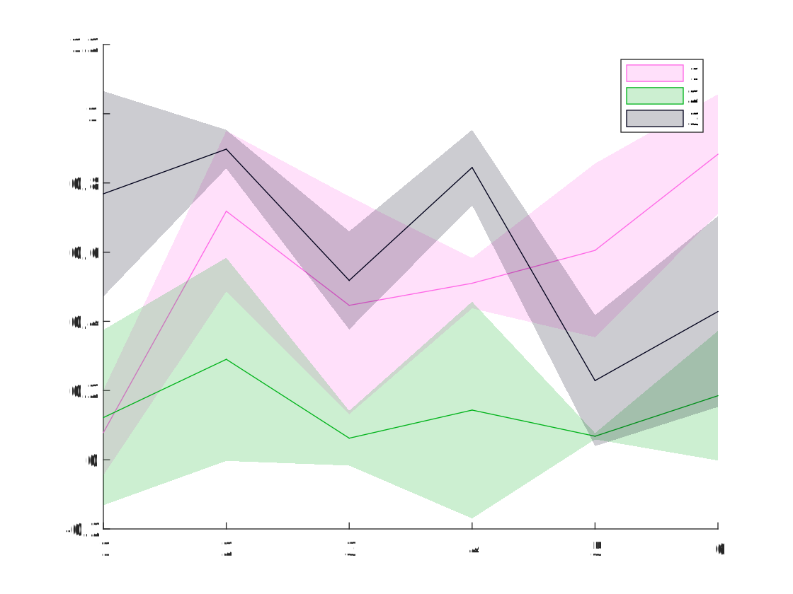
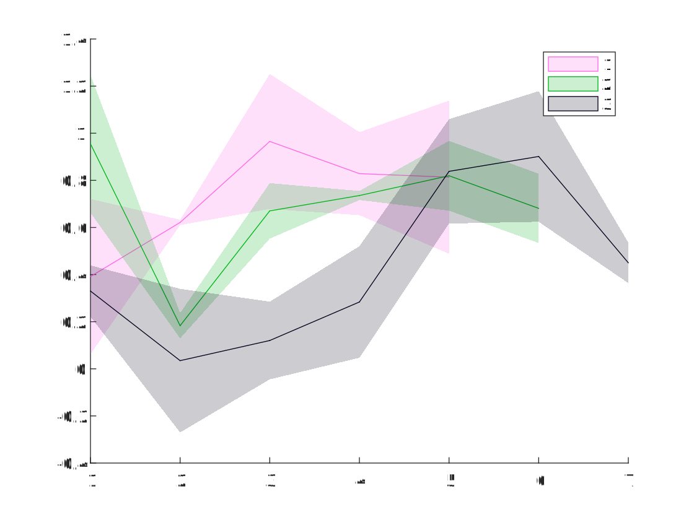

埃博拉酱的MATLAB扩展工具包，提供一系列MATLAB内置函数所欠缺，但却常用的增强功能。依赖[Win32API](https://ww2.mathworks.cn/matlabcentral/fileexchange/102159-win32-file-shell-api)

本项目的发布版本号遵循[语义化版本](https://semver.org/lang/zh-CN/)规范。开发者认为这是一个优秀的规范，并向每一位开发者推荐遵守此规范。
# 目录
本包中所有函数均在命名空间下，使用前需import。使用命名空间是一个好习惯，可以有效防止命名冲突，避免编码时不必要的代码提示干扰。
- [+MATLAB](#MATLAB)
	- [+Addons](#Addons) 本包用于开发人员管理发布包，以及用户查询包依赖项。
		- [GetRequirements](#GetRequirements) 获取包中包含的依赖项列表
		- [PublishRequirements](#PublishRequirements) 在包目录下生成一个依赖项.mat文件
	- [+AudioVideo](#AudioVideo)
		- [VideoPreview](#VideoPreview) 生成一张图片作为视频文件的预览
	- [+Containers](#Containers)
		- [@IndexMap](#IndexMap) IndexMap是一种自动分配键的映射
		- [@IQueue](#IQueue) 一个接口，表示对象的先进先出集合。
		- [@Queue](#Queue) IQueue的简单基本实现
	- [+DataFun](#DataFun)
		- [FindGroupsN](#FindGroupsN) 内置findgroups的升级版，支持任意数组类型，并可以指定拆分维度，missing类值视为相等的有效数据
		- [MaxSubs](#MaxSubs) 返回数组的最大值以及所在的坐标。
		- [MeanSem](#MeanSem) 一次性高效算出数据沿维度的平均值和标准误
		- [MinSubs](#MinSubs) 返回数组的最小值以及所在的坐标。
		- [Rescale](#Rescale) 数组元素沿指定维度的缩放范围
	- [+DataTypes](#DataTypes)
		- [@ArrayBuilder](#ArrayBuilder) 数组累加器类
		- [ArrayFun](#ArrayFun) 内置arrayfun的升级版，支持指定维度、单一维度隐式扩展和返回数组自动拼接
		- [Cell2Mat](#Cell2Mat) cell2mat的升级版
		- [FolderFun](#FolderFun) 取对一个文件夹下所有满足给定文件名模式的文件的绝对路径，对它们执行函数（仅限Windows）
		- [RepeatingFun](#RepeatingFun) 重复多次调用函数，为每个重复参数生成一个返回值
		- [Select](#Select) 对多张表格实施类似于 SQL SELECT 的查询操作
	- [+ElFun](#ElFun)
		- [AngleND](#AngleND) 计算两个N维空间向量的夹角弧度
	- [+ElMat](#ElMat)
		- [IsEqualN](#IsEqualN) 内置isequaln的升级版，支持任意数组类型，并可以指定比较维度，返回逻辑数组
		- [LinSpace](#LinSpace) 支持任意维度数组的linspace
		- [OrderedDimensionSize2IndexArray](#OrderedDimensionSize2IndexArray) 根据维度顺序和尺寸，生成自定义的下标转线性索引数组
		- [OrderedDimensionSize2SubsVectors](#OrderedDimensionSize2SubsVectors) 根据维度顺序和尺寸，生成自定义的线性索引转下标向量
		- [PadCat](#PadCat) 内置cat函数的魔改版，可以给不兼容数组自动补全空值
	- [+General](#General)
		- [BuiltinPaths](#BuiltinPaths) 列出所有MATLAB官方API的搜索路径
		- [CD](#CD) 内置cd函数的升级版，支持打开目录选择对话框要求用户手动选择当前目录
		- [CopyFile](#CopyFile) 调用 Win32 ShellAPI 执行可撤销的批量文件复制
		- [Delete](#Delete) 调用 Win32 ShellAPI 执行可撤销的批量文件、目录删除
		- [Load](#Load) 内置load函数的魔改版，取消适用场合限制，支持直接输出变量
		- [MoveFile](#MoveFile) 调用 Win32 ShellAPI 执行可撤销的批量文件移动
		- [Save](#Save) 内置save函数的魔改版
		- [StaticJavaPath](#StaticJavaPath) 确认Java路径已添加到静态路径列表
	- [+Graph2D](#Graph2D)
		- [MultiShadowedLines](#MultiShadowedLines) 绘制多条误差阴影线图
	- [+Graphics](#Graphics)
		- [FigureAspectRatio](#FigureAspectRatio) 设置当前图窗的纵横比
	- [+IOFun](#IOFun)
		- [DelimitedStrings2Table](#DelimitedStrings2Table) 将一列分隔符字符串的前几个字段读出为表格或时间表
		- [MatVariableRename](#MatVariableRename) 批量重命名.mat文件中的变量
		- [XmlDom2String](#XmlDom2String) 将org.w3c.dom.Document导出为XML文本
		- [XmlString2Dom](#XmlString2Dom) 将XML字符串解析为org.w3c.dom.Document类型
	- [+Lang](#Lang)
		- [DistributeVararginByValidation](#DistributeVararginByValidation) 根据验证函数将输入的Varargin分发到输出变量
		- [GetNthOutputs](#GetNthOutputs) 获取函数的第N个输出
		- [Input](#Input) 内置input函数的优化版
	- [+Ops](#Ops)
		- [IsMemberN](#IsMemberN) 内置ismember的升级版，支持任意数组类型，并可以指定拆分维度，missing类值视为相等的有效数据
		- [SetDiffN](#SetDiffN) 内置setdiff的升级版，支持任意数组类型，并可以指定拆分维度，missing类值视为相等的有效数据
		- [UnionN](#UnionN) 内置union的升级版，支持任意数组类型，并可以指定拆分维度，missing类值视为相等的有效数据，还能同时合并多个集合
		- [UniqueN](#UniqueN) 内置union的升级版，支持任意数组类型，并可以指定拆分维度，missing类值视为相等的有效数据
	- [+Parallel](#Parallel)
		- [@MmfSemaphore](#MmfSemaphore) 使用内存映射文件来模拟一个信号量，用于跨进程资源分配。
	- [+Project](#Project)
		- [ListAllProjectPaths](#ListAllProjectPaths) 列出指定工程所添加的搜索路径
	- [+SpecFun](#SpecFun)
		- [LogicalExhaustion](#LogicalExhaustion) 穷举一定长度的所有可能的逻辑向量
		- [Subsets](#Subsets) 列出集合的所有子集
	- [+UITools](#UITools)
		- [OpenFileDialog](#OpenFileDialog) 可以设置初始目录，以及保存上次所在目录的文件打开对话框（仅限Windows）
		- [SaveFileDialog](#SaveFileDialog) 可以设置初始目录，以及保存上次所在目录的文件保存对话框（仅限Windows）
- [+MatlabShared](#MatlabShared)
	- [+SupportPkg](#SupportPkg) 一键获取MATLAB硬件支持包
		- [InstallSupportPackages](#InstallSupportPackages) 安装下载好的支持包
		- [SupportPackageDownloader](#SupportPackageDownloader) 下载支持包下载器
# +MATLAB
## +Addons
本包用于开发人员管理发布包，以及用户查询包依赖项。
### 依赖版本结构体
要使用本包中的依赖版本管理工具，你的包目录下必须有一个Version函数，返回依赖版本结构体。

依赖版本结构体包含一个Me字段，存储本包的版本号。其它字段则为所有依赖包的包名。如果依赖包名有点号分割，则表示为点索引的次级结构体。例如你开发的包A.B版本1.0.0，依赖包C.D版本1.1.0、包C.E-2.2.0和包F-1.3.0，则你应当撰写一个A.B.Version函数，返回含有如下字段的结构体：
- Me(1,1)string="1.0.0"，本包的版本号
- C(1,1)struct，依赖包C.D和C.E共用的顶级限定名，为一个结构体，包含如下字段：
	- D(1,1)struct，至少包含一个字段Me(1,1)string="1.1.0"，为包C.D的版本号。也可以继续包含C.D自身的其它依赖项。可以在包C.D中也包含一个同构的Version函数，实现递归调用。
	- E(1,1)struct，类似于C.D依赖项，C.E也有一个Me字段为版本号"2.2.0"
- F(1,1)struct，至少包含一个字段Me(1,1)string="1.3.0"

A.B.Version函数代码示例：
```MATLAB
function V=Version
V.Me="1.0.0";
%假定这些依赖包也都包含Version函数，则可以进行递归调用
V.C.D=C.D.Version;
V.C.E=C.E.Version;
V.F=F.Version;
%假设还依赖一个包G不包含Version函数，则必须手动输入
V.G.Me="1.3.0";
```
### GetRequirements
获取包中包含的依赖项列表

如果包目录下有一个依赖项.mat文件，本函数将载入那个文件并将其中的RequirementTable返回。该文件记录了包发布时所有依赖项的版本信息。可由[PublishRequirements](#PublishRequirements)生成。

输入参数：PackageName(1,1)string，要查看依赖信息的包名，默认本包（EbolaChan.MatlabExtension）

返回值：RequirementTable(:,2)table，第1列Package，第2列Version，列出该包发布时所有依赖项和版本
### PublishRequirements
在包目录下生成一个依赖项.mat文件

本函数用于包开发人员。当包下含有返回[依赖版本结构体](#依赖版本结构体)的Version函数时，可以用本函数在同目录下生成一个"依赖项.mat"，保存版本依赖结构体的所有一级依赖项的当前版本。这样当你的包发布给用户后，用户可以用[GetRequirements](#GetRequirements)得到你的包发布时所有依赖项的版本，然后逐一下载安装所有的依赖项。

输入参数：PackageName(1,1)string，你的包名，需要在该包下包含Version函数，返回版本依赖结构体

返回值：RequirementTable(:,2)table，第1列Package，第2列Version，列出该包发布时所有依赖项和版本
## +AudioVideo
### VideoPreview
生成一张图片作为视频文件的预览

*名称值参数*

VideoPath(1,1)string，视频文件路径。默认打开文件选择对话框供用户手动选择。

PreviewOption(1,1)MATLAB.AudioVideo.PreviewOptions=MATLAB.AudioVideo.PreviewOptions.First，生成图片的方式

*返回值*

Preview(:,:)，预览图
## +Containers
### @IndexMap
IndexMap是一种自动分配键的映射

添加值时不能手动指定键，只能接受自动分配的返回键；访问时则跟映射相同，用键访问。

本类构造无需任何参数，也没有任何属性，只有如下成员方法可用：

**Count**

返回对象中的键-值对组的数量

**Items**

获取或设置与指定的键关联的值。

*语法*
```MATLAB
Values=obj.Items
%以元胞数组的形式返回输入 IndexMap 对象的所有值。

Values=obj.Items(Keys)
%返回与Keys中指定的键对应的值。输出参数 Values 的大小与 Keys 相同。

obj.Items(Keys,Value1,Value2,…)
%设置指定键的值
```
*输入参数*

Keys，要设置或指定的键向量。请使用从Add返回的键，自定义键可能会产生意外问题。如不指定此参数，将返回所有值。

Value1,Value2,…，可选，要设置的键值。如果设置此参数，键向量长度和值的个数必须相同。

*返回值*

Values，指定键对应的值排列成元胞向量。如未指定Keys，将返回所有值。

**Add**

将指定的值添加到IndexMap中，返回自动分配的新键。

*语法*
```MATLAB
Keys=obj.Add(Value1,Value2,…)
```
*输入参数*

Value1,Value2,…，要添加的元素的值，可以重复指定多个要添加的新值

*返回值*

Keys，为添加的元素分配的新键，与每个输入值一一对应。

**Allocate**
预分配指定数目的新键，暂不赋值

新键对应的值可能是未初始化的任意值

*语法*
```MATLAB
Keys=obj.Allocate
%分配一个新键

Keys=obj.Allocate(Number)
%分配指定数目的新键
```
*输入参数*

Number=1，可选，分配新键的数目

*返回值*

Keys，分配的指定数目的新键

**Clear**

将所有键和值从IndexMap中移除。

Count属性设置为0，但不会立即释放对集合的元素的其他对象的引用。如有必要请先手动delete对象。

**IsKey**

确定 IndexMap 对象是否包含键

*语法*
```MATLAB
IK=obj.IsKey(Keys)
%如果 obj 包含指定的键，将返回 1 (true)，否则将返回 0 (false)。如果 Keys 是指定多个键的数组，则 IK 是具有相同大小的逻辑数组。
```
*输入参数*

Keys，要在 IndexMap 对象中搜索的键向量

*返回值*

IK，指示每个键是否存在的逻辑向量。

**Keys**

返回一个向量，其中包含 IndexMap 对象中的所有键。

**Remove**

从 IndexMap 对象中删除键-值对组

*语法*
```MATLAB
obj.Remove(Keys)
%从输入 IndexMap 对象中删除指定的键以及与它们关联的值。
```
*输入参数*

Keys，要从 IndexMap 对象中删除的键-值对组的键。对应的值也被删除，但不会立即释放对集合的元素的其他对象的引用。如有必要请先手动delete对象。
### @IQueue
一个接口，表示对象的先进先出集合。

IQueue是一个对象的流水线，对象被一个接一个插入队尾，然后按照插入的顺序一个接一个从队首取出，而不支持随机插入、取出中间的对象。可以对 IQueue 及其元素执行三个主要操作：
- Enqueue 将一个元素添加到队列的末尾。
- Dequeue 从队列的开头移除最旧的元素。
- Peek 返回位于队列开头的最旧元素，但不会将其从队列中删除。

**成员方法**

*Count*

获取 IQueue 中包含的元素数。

返回值：(1,1)double，IQueue 中包含的元素数。

*Clear*

从 IQueue 中移除所有对象。

注意，此方法不会立即释放集合中的对象，也不会显式delete。对于必须立即释放的元素，您必须使用Dequeue取出然后手动释放。

*Contains*

确定某些元素是否在 IQueue 中。

语法
```MATLAB
C=obj.Contains(Element1,Element2,…)
```
输入参数：Element，要在队列中定位的对象。重复输入此参数可以一次性确定多个对象。

返回值：C(1,:)logical，按照Element的输入顺序返回每个Element是否存在的逻辑值。

*Dequeue*

移除并返回位于 IQueue 开始处的对象。

此方法类似于 Peek 方法，但 Peek 不修改 IQueue。

语法
``` MATLAB
obj.Dequeue
%移除队首的第1个对象

obj.Dequeue(Number)
%从队首开始移除多个对象

Elements=obj.Dequeue(___)
%返回被移除的对象，可以与上述任意语法组合使用
```
输入参数：Number，要移除的对象个数。

返回值：Elements(1,:)cell，被移除的对象，按照它们在队列中从头到尾的顺序，并用元胞包装。

提示：如果Number>obj.Count，将仅取出obj.Count个对象，而不产生错误。因此您可以指定Number为Inf以取出所有对象。

*Enqueue*

将对象添加到 IQueue 的结尾处。

语法
```MATLAB
obj.Enqueue(Element1,Element2,…)
```
输入参数：Element，要添加到 IQueue 的对象。重复输入此参数可以依次插入多个对象。

*IsEmpty*

检查队列是否为空

返回值：(1,1)logical，若队列为空，true；否则false

*Peek*

返回位于 IQueue 开始处的对象但不将其移除。

返回值：(1,:)cell。如果队列为空，返回空元胞{}；否则返回包装着队首元素的元胞标量。

*ToArray*

将 IQueue 元素复制到新数组。

返回值：(1,:)cell，包含从 IQueue 复制的元素的新数组，每个元素都用元胞包装。
### @Queue
IQueue的简单基本实现

**构造函数**

初始化 Queue 类的新实例。

*语法*
```MATLAB
import MATLAB.Containers.Queue
obj=Queue
%初始化 Queue 类的新实例，该实例为空

obj=Queue(Element1,Element2,…)
%初始化 Queue 类的新实例，该实例从头到尾包含指定顺序的多个元素。
```
输入参数：Element，要放入队列的初始元素。重复输入此参数，以从头到尾排列多个元素。

**成员方法**

本类成员方法与IQueue接口类完全相同，请参见[@IQueue](#IQueue)文档
## +DataFun
### FindGroupsN
内置findgroups的升级版，支持任意数组类型，并可以指定拆分维度，missing类值视为相等的有效数据
```MATLAB
%不同于内置，本函数必须指定一个分组维度，且不支持对表进行分组（因为表只有一个维度可以分组，直接用内置函数就行了呗）
[G,ID]=MATLAB.DataFun.FindGroupsN(A,Dimension);
```
**示例**
```MATLAB
import MATLAB.DataFun.FindGroupsN
A=[
0 0 NaN
NaN NaN 0
0 0 NaN
];
%沿不同维度分组会产生不同结果，且NaN值会被视为相等
[G,ID]=FindGroupsN(A,1)
%{
G =

	1
	2
	1


ID =

	0     0   NaN
   NaN   NaN     0
%}
[G,ID]=FindGroupsN(A,2)
%{
G =

	1
	1
	2


ID =

	0   NaN
   NaN     0
	0   NaN
%}
```
**输入参数**

A，分组变量，可以是任意尺寸、任意类型的MATLAB标准数组

Dimension(1,1)，拆分维度，必须是正整数。数组将按此维度被拆分为子数组，然后将它们看作单个元素比较相等性。

**输出参数**

G(:,1)，组编号。无论输入维度为何，此参数总是返回正整数列向量。不同于内置，missing类值也会被赋予有效的组编号。

ID，用于标识每个组的值。各维尺寸与A相同，除了在Dimension维度上仅包含A的唯一值，与组编号对应。ID在Dimension维度上用G进行索引可以得到A。

**提示**

本函数在实际算法上仅仅是MATLAB.Ops.UniqueN的特化形式，为了与内置findgroups对应而存在。参考MATLAB.Ops.UniqueN文档获取更多丰富用法。
### MaxSubs
返回数组的最大值以及所在的坐标。

MATLAB自带的max函数只能返回多维数组最大值的线性索引。本函数一口气返回最大值以及多维坐标，方便易用
```MATLAB
%对于有多个最大值的数组，返回线性索引最小的那个位置的坐标：
[M,S1,S2]=MATLAB.DataFun.MaxSubs([9 9 1;1 4 4;9 8 9])
%{
M =

	9


S1 =

	1


S2 =

	1
%}
%还可以指定运算维度。如将一个3维数组的后两维求最大值和下标，则返回的最大值和下标都是沿第1维的向量，且只返回最大值在后两维的下标
[M,S2,S3]=MATLAB.DataFun.MaxSubs(rand(3,3,3),[2 3])
%坐标维度输出顺序与输入的指定Dimension有关
[M,S3,S2]=MATLAB.DataFun.MaxSubs(rand(3,3,3),[3 2])
```

**位置参数**

Data，必需，要寻找最大值的多维数组

Dimensions(1,:)uint8，可选，要取最大值的维度。返回值在这些维度上长度将为1，在其它维度上排列最大值。默认所有维度都参与运算，即返回单一标量作为整个数组的最大值，并按顺序返回该最大值各个维度的坐标。

**返回值**

Value(1,1)，最大值

[S1,S2, …, Sn]，最大值所在的位置中，线性索引最小的那个位置的坐标。每个返回值依次代表各维度的坐标。只包含Dimensions维度的坐标，并按照Dimension指定的顺序排列输出。
### MeanSem
一次性高效算出数据沿维度的平均值和标准误。

具体算法：
$$S=\sum x$$
$$Mean=\frac{S}{N}$$
$$SEM=\frac{\sqrt{\sum{x^2}-S\cdot Mean}}{N}$$
```MATLAB
[Mean,SEM]=MeanSem([0 6 3;8 7 6;9 7 1],1)
%{
Mean =

    5.6667    6.6667    3.3333


SEM =

    2.3254    0.2722    1.1863
%}
[Mean,SEM]=MeanSem([0 6 3;8 7 6;9 7 1])
%{
Mean =

    5.2222


SEM =

    0.9910
%}
```
**输入参数**

Data，数据数组

Dimensions，可选，聚合维度。输出的Mean和SEM，其Dimensions维度上长度为1，其它维度上长度与Data相同。默认所有维度，此时Mean和SEM为全局平均数和标准误标量。

**返回值**

Mean double，沿维度的平均值

SEM double，沿维度的标准误
### MinSubs
返回数组的最小值以及所在的坐标。

MATLAB自带的min函数只能返回多维数组最小值的线性索引。本函数一口气返回最小值以及多维坐标，方便易用
```MATLAB
%对于有多个最小值的数组，返回线性索引最小的那个位置的坐标：
[M,S1,S2]=MATLAB.DataFun.MinSubs([9 9 1;1 4 4;9 8 9])
%{
M =

	1


S1 =

	2


S2 =

	1
%}
%还可以指定运算维度。如将一个3维数组的后两维求最小值和下标，则返回的最小值和下标都是沿第1维的向量，且只返回最小值在后两维的下标
[M,S2,S3]=MATLAB.DataFun.MinSubs(rand(3,3,3),[2 3])
%坐标维度输出顺序与输入的指定Dimension有关
[M,S3,S2]=MATLAB.DataFun.MinSubs(rand(3,3,3),[3 2])
```
**位置参数**

Data，必需，要寻找最小值的多维数组

Dimensions(1,:)uint8，可选，要取最小值的维度。返回值在这些维度上长度将为1，在其它维度上排列最小值。默认所有维度都参与运算，即返回单一标量作为整个数组的最小值，并按顺序返回该最小值各个维度的坐标。

**返回值**

Value(1,1)，最小值

[S1,S2, …, Sn]，最小值所在的位置中，线性索引最小的那个位置的坐标。每个返回值依次代表各维度的坐标。只包含Dimensions维度的坐标，并按照Dimension指定的顺序排列输出。
### Rescale
数组元素沿指定维度的缩放范围

MATLAB内置rescale函数不能指定维度，只能在整个数组范围内缩放。本函数解决该问题，允许指定Dimensions参数为运算维度。
```MATLAB
import MATLAB.DataFun.Rescale
%将整个数组缩放到[0,1]范围
Data=rand(4,4,4,4)*10;
%指定缩放维度范围。维度范围[2 4]意味着，以1×4×1×4数组为单位，在这4×1×4×1个数组内部分别进行缩放。
Rescale(Data,[2 4]);
%指定缩放范围[2,3]
Rescale(Data,2,3);
%同时指定缩放范围和维度范围
Rescale(Data*10,2,3,[2 4]);
```
**用法**
```MATLAB
import MATLAB.DataFun.Rescale
Rescale(Array);
Rescale(Array,Dimensions);
Rescale(Array,LowerBound,UpperBound);
Rescale(Array,LowerBound,UpperBound,Dimensions);
```
Array，必需，数值数组

LowerBound(1,1)，缩放下界

UpperBound(1,1)，缩放上界

Dimensions(1,:)，维度范围

**返回值**

Array，缩放后的数组
## +DataTypes
### @ArrayBuilder
数组累加器类

将数据向内存中积累时，经常遇到需要不断累加数组的问题，MATLAB会提示预分配内存。但如果读取之前无法得知将会有多少项，预分配就会变成一个十分麻烦的动态任务。本类建立一个增长维度，在此维度上可以不断累加一个内置的数组。用户只需不断Append即可，无需考虑内存分配的问题，本类会自动进行优化的内存管理。
```MATLAB
%构造一个沿第1维度累加的数组
Ab=MATLAB.DataTypes.ArrayBuilder(1);
%重复累加
for a=1:3
  Ab.Append(randi([0 9],randi([0 3]),3));
end
Ab.Harvest
%继续累加
for a=1:3
  Ab.Append(randi([0 9],randi([0 3]),3));
end
Ab.Harvest
%{
ans =

	8     3     4
	8     2     9
	0     8     1
	1     1     8
	5     8     3
	1     6     5


ans =

	8     3     4
	8     2     9
	0     8     1
	1     1     8
	5     8     3
	1     6     5
	0     2     1
	//数据随机生成，每次运行可能不同
%}
```

构造参数：BuildDimension(1,1)uint8=1，累加维度。数组的这个维度将不断累加增长，其它维度将由第一次Append决定，以后不再改变。

**只读属性**

BuildDimension(1,1)uint8，累加维度

**成员方法**

`Append`

向数组累加新内容

输入参数：New，要累加的内容。第一次可以累加任意内容，以后累加内容可以和第一次在累加维度上尺寸不一致，其它维度必须尺寸一致。

`Harvest`

收获累加完毕的MATLAB数组。收获后可以释放本对象，也可以继续累加。

返回值：Array，累加完毕的MATLAB数组。

`Clear`

清空储藏，从零开始重新累加，而不必新建对象重新分配内存，具有较高的性能。
### ArrayFun
内置arrayfun的升级版，支持指定维度、单一维度隐式扩展和返回数组自动拼接

内置arrayfun只能进行按元素运算，不能按行、按列甚至按平面运算，而且不支持单一维度隐式扩展，如果返回值不是标量还不能自动拼接。采用本函数可以实现按任意维度运算，且支持单一维度隐式扩展，返回数组自动拼接。
```MATLAB
import MATLAB.DataTypes.ArrayFun

ArrayFun(Function,A);
%基本语法，与arrayfun行为相同

ArrayFun(Function,A1,…,An);
%多个数组作为参数时，允许各数组对应维度尺寸相同或为1。而arrayfun要求尺寸必须相同。

ArrayFun(___,Name=Value);
%指定运算维度和拼接方式，不支持arrayfun的UniformOutput参数，详见参数说明。

B=ArrayFun(___);
%返回值拼接成和扩展后的输入数组尺寸相同的数组，但名称值参数可能改变此行为

[B1,…,Bn]=ArrayFun(___);
%每个返回值数组都是由Function对应位置的返回值按同样方式拼接而来。
```
**示例**
```MATLAB
import MATLAB.DataTypes.*
%% 本函数最主要的功能是，将不支持向量化的函数在形式上强行向量化：
A={[1 2] 3};
B={[1 2] 3;[1 2] 4};
%A和B的第1行相等，第2行不等，我们希望两者按行比较相等性，得到[true;false]这样的结果。但是元胞数组不支持==运算，isequal也只能得出两个数组不相等的结论。此时可以：
Equal=ArrayFun(@isequal,A,B,Dimension=2,CatMode=CatMode.Scalar)
%上述语句意义是，对A和B向量化进行isequal比较，将第2维打包作为单个元素，返回值是标量。第2维打包后A就变成了单个元素，B变成了列向量，然后按元素比较相等性，A可以自动扩展成同尺寸的列向量，于是得到：
%{
Equal =

  2×1 logical 数组

   1
   0
%}

%% 图像拼接-1
%本示例将一系列宽度相同的图片纵向拼接成一张长图。假设ImagePaths是一个包含了待拼接图像路径的列向量
imshow(ArrayFun(@imread,ImagePaths,CatMode=CatMode.Linear));
%由于ImagePaths是向量，且imread返回uint8数值类型，因此以下写法也是等效的：
imshow(ArrayFun(@imread,ImagePaths,CatMode=CatMode.Linear));

%% 图像拼接-2
%同样是拼接图象，如果ImagePaths是一个待拼接的子图路径的矩阵呢？同样可以按照这个矩阵对这些图像自动进行二维拼接！
imshow(ArrayFun(@imread,ImagePaths,CatMode=CatMode.CanCat));

%% 序列采样-拆分打包与隐式扩展的相互作用展示
Sequence=1:10;
Start=(1:5)';
End=(6:10)';
disp(ArrayFun(@(Sequence,Start,End)Sequence(Start:End),Sequence,Start,End,Dimension=-1,CatMode=CatMode.Linear));
%输出
%     1     2     3     4     5     6
%     2     3     4     5     6     7
%     3     4     5     6     7     8
%     4     5     6     7     8     9
%     5     6     7     8     9    10
%注意，由于Dimension=-1，因此具有单一第1维的Sequence发生了隐式扩展，而具有单一第2维的Start和End未发生隐式扩展，而是直接打包交付给Function运算。
```
**位置参数**

Function(1,1)function_handle，必需，要执行的函数。必须接受等同于Arguments重复次数的参数

A1,…,An，重复，输入参数数组。输入的数组个数必须等于Function所能接受的输入值个数。不允许输入表格或其它非MATLAB标准数组，请始终先转化为MATLAB数组或元胞数组。

**名称值参数**

*Dimension*(1,:)=[]，运算维度。可以执行以下类型值：
- 正整数向量。此时A1,…,An会将被指定的这些维度打包交付给Function，Function收到的这些参数在指定维度上和原数组相同，其它维度上尺寸为1。因此被指定的这些维度可以具有任意的尺寸而不会被repmat重复。但其它维度上仍然要求要么具有相同的尺寸，要么尺寸为1；其中尺寸为1的维度会调用repmat自动重复到与其他数组匹配的尺寸。
- 负整数向量。此时A1,…,An会将被指定的这些维度拆分，其它维度打包交付给Function，Function收到的这些参数在指定维度上尺寸为1，其它维度上尺寸和原数组相同。因此被指定的这些维度要么具有相同的尺寸，要么尺寸为1；其中尺寸为1的维度会调用repmat自动重复到与其他数组匹配的尺寸。其它维度可以具有任意的尺寸而不会被repmat重复。指定负整数向量作为Dimension，等价于指定其它维度的正整数向量作为Dimension。
- 空值，相当于所有维度都拆分。此时Function会接收到A1,…,An的单个元素作为参数，因此A1,…,An在每个维度上要么具有相同的尺寸，要么尺寸为1。尺寸为1的维度会调用repmat自动重复到与其他数组匹配的尺寸。
- 0，相当于所有维度都打包。此时Function会一次性接收到A1,…,An的全部元素作为参数，即等价于直接调用Function(A1,…,An)，因此A1,…,An各维度均可以具有任意的尺寸。

*CatMode*(1,1)MATLAB.DataTypes.CatMode=MATLAB.DataTypes.CatMode.Scalar，返回值拼接选项，根据Function的返回值设定：
- DontCat，不拼接，行为类似于arrayfun的UnformOutput=true，为每次Function调用返回值套上一个元胞变成标量返回，拼接成在拆分维度上尺寸和输入数组相同、打包维度上尺寸均为1的元胞数组。
- CanCat，Function的返回值为数组，允许尺寸不同，但最终可以拼接成一整个大数组。将在DontCat基础上调用MATLAB.DataTypes.Cell2Mat完成拼接。
- EsNlcs，Function的返回值为数值、逻辑、字符或字段相同的结构体数组，且尺寸完全相同。将在DontCat基础上调用cell2mat完成拼接。
- Linear，Dimension为负整数标量或等价情况，且返回值在该维度以外的维度上尺寸均相等，可以在DontCat基础上用cat线性串联成数组
- Scalar，Function的返回值为标量，可以UniformOutput=true直接返回数组。

无论何种情况，都可以设为DontCat；其它选项都必须满足特定条件（对Function的每个返回值）。此外若Function的任何一个返回值是函数句柄，不能拼接成数组，只能选择DontCat。对于任何可拼接的情况，选择CanCat都能完成拼接，但性能最低。如果您确定您的函数返回值可以满足更苛刻的条件，应尽量优先选择Scalar>Linear>EsNlcs>CanCat

*Warning*(1,1)logical=true，如果输入参数只有一个且为空，Function将不会被调用，因而无法获知返回值的数据类型，可能会与输入参数不为空的情况出现不一致的情形。该参数指定这种情况下是否要显示警告。

**输出参数**

返回值为由Function的返回值按其所对应的参数在数组中的位置拼接成的数组。如果Function具有多个返回值，则每个返回值各自拼接成数组，作为本函数的多个返回值。根据CatMode不同：
- DontCat，返回元胞数组，尺寸与输入在拆分维度的尺寸相同，打包维度上尺寸为1。元胞里是对应位置的参数包输入Function产生的返回值。
- Linear & EsNlcs & CanCat，返回数组，该数组由DontCat返回值在拆分维度上的拼接得到
- Scalar，返回数组，尺寸与输入在拆分维度上的尺寸相同，打包维度上尺寸为1

**局限性**

本函数具有和arrayfun类似的局限性。虽然能将不可向量化的函数强行“向量化”，但这种向量化是纯软件实现，不受硬件支持，因此不能获得性能提升，对特定的简单问题甚至性能比for循环更差。本函数的主要意义在于增加代码可读性。
### Cell2Mat
cell2mat的升级版

本函数是cell2mat的升级版，使用前请先参阅cell2mat函数文档，了解其功能和局限性。

cell2mat是一个功能十分强大的MATLAB函数，可以将元胞数组内的数组提取出来，拼成一个大数组，而且这些数组的尺寸不必完全相同，例如可以支持以下拼接：


但它也存在局限性。首先，只支持数值、逻辑、结构体、字符的拼接，其它常见数据类型（字符串、元胞、类对象）都无法使用。其次。对于以下结构，虽然尺寸恰好合适，但也无法拼接：


这是因为cell2mat默认先拼第1维，自然会遇到尺寸不匹配的问题。但我们可以看到，只要先拼第2维，就可以得到1×3和2×3两个矩阵，然后第1维就可以拼接了。本函数不仅支持各种数据类型，还会自动尝试从不同的维度进行拼接，因此支持更多复杂的结构。

输入参数：Cells cell，要拼接的元胞数组，各元胞内含有数据类型一致的数组，且各维尺寸上恰好可以拼接成一个大数组，维度不限。

返回值：拼接好的大数组
### DimensionFun
对数组按维度执行函数，支持单一维度隐式扩展和返回数组自动拼接

对数组进行批处理是十分常用的操作。但是arrayfun和cellfun只能进行按元素运算，不能按行、按列甚至按平面运算，而且不支持单一维度隐式扩展，如果返回值不是标量还不能自动拼接。采用本函数可以实现按任意维度运算，且支持单一维度隐式扩展，返回数组自动拼接。
```MATLAB
import MATLAB.DataTypes.DimensionFun
import MATLAB.DataTypes.CatMode
%% 图像拼接-1
%本示例将一系列宽度相同的图片纵向拼接成一张长图。假设ImagePaths是一个包含了待拼接图像路径的列向量
imshow(DimensionFun(@imread,ImagePaths,CatMode=CatMode.Linear));
%由于ImagePaths是向量，且imread返回uint8数值类型，因此以下写法也是等效的：
imshow(DimensionFun(@imread,ImagePaths,CatMode=CatMode.Linear));
%% 图像拼接-2
%同样是拼接图象，如果ImagePaths是一个待拼接的子图路径的矩阵呢？同样可以按照这个矩阵对这些图像自动进行二维拼接！
imshow(DimensionFun(@imread,ImagePaths,CatMode=CatMode.CanCat));
%% 异形数组拼接
A={1 [2 3]
[4 5] 6}
%此元胞数组直接使用cell2mat拼接会报错，但可以使用本函数拼接：
C=DimensionFun(@cell2mat,A);
%此示例仅用于展示DimensionFun的拼接功能，实际上可以直接使用MATLAB.DataTypes.Cell2Mat(A)一步到位。本函数实际上也是调用该函数实现的。
%% 序列采样-拆分打包与隐式扩展的相互作用展示
Sequence=1:10;
Start=(1:5)';
End=(6:10)';
disp(DimensionFun(@(Sequence,Start,End)Sequence(Start:End),Sequence,Start,End,SplitDimensions=1,CatMode=CatMode.Linear));
%输出
%     1     2     3     4     5     6
%     2     3     4     5     6     7
%     3     4     5     6     7     8
%     4     5     6     7     8     9
%     5     6     7     8     9    10
%注意，由于SplitDimensions仅为第1维，因此具有单一第1维的Sequence发生了隐式扩展，而具有单一第2维的Start和End未发生隐式扩展，而是直接打包交付给Function运算。
```
**位置参数**

Function(1,1)function_handle，必需，要执行的函数。必须接受等同于Arguments重复次数的参数

Arguments，重复，输入参数数组。输入的数组个数必须等于Function所能接受的输入值个数。所有数组在SplitDimensions上的尺寸要么相等，要么为1，不允许各不相同的维度尺寸。不允许输入表格或其它非MATLAB标准数组，请始终先转化为MATLAB数组或元胞数组。

**名称值参数**

*以下两个参数只能选择其中一个进行指定*

另一个将会自动计算得出。如果两个参数都不指定，将把第一个Arguments所有非单一维度视为SplitDimensions，其它维度作为PackDimensions。

PackDimensions(1,:)uint8，将每个Arguments数组的指定维度打包，在其它维度（即SplitDimensions）上拆分，分别交付给Function执行

SplitDimensions(1,:)uint8，在每个Arguments数组的指定维度上拆分，将其它维度（即PackDimensions）打包，分别交付给Function执行

注意，拆分-打包步骤在隐式扩展之前。也就是说，由于PackDimensions指定的维度被包入了同一个元胞当中，尺寸恒为1，即使不同数组间这些维度具有不同的尺寸，也不会进行隐式扩展。隐式扩展仅在SplitDimensions中进行。

*以下两个参数可任意指定或不指定*

CatMode(1,1)MATLAB.DataTypes.CatMode=MATLAB.DataTypes.CatMode.CanCat，返回值拼接选项，根据Function的返回值设定，必须为以下四者之一：
- Scalar，Function的返回值为标量，将调用arrayfun完成拼接。
- Linear，SplitDimensions为标量，且Function的返回值为类型、PackDimensions维度上尺寸均相同的数组。将调用cat完成拼接。
- EsNlcs，Function的返回值为数值、逻辑、字符或字段相同的结构体数组，且尺寸完全相同。将调用cell2mat完成拼接。
- CanCat，Function的返回值为数组，允许尺寸不同，但最终可以拼接成一整个大数组。将调用MATLAB.DataTypes.Cell2Mat完成拼接。
- DontCat，不符合上述任何条件，或返回值为函数句柄。将不会拼接，返回元胞数组。

无论何种情况，都可以设为DontCat；其它选项都必须满足特定条件（对Function的每个返回值）。此外若Function的任何一个返回值是函数句柄，都只能选择DontCat。对于任何可拼接的情况，选择CanCat都能完成拼接，但性能最低。如果您确定您的函数返回值可以满足更苛刻的条件，应尽量优先选择Scalar>Linear>EsNlcs>CanCat。

Warning(1,1)logical=true，如果输入参数只有一个且为空，Function将不会被调用，因而无法获知返回值的数据类型，可能会与输入参数不为空的情况出现不一致的情形。该参数指定这种情况下是否要显示警告。

**返回值**

返回值为由Function的返回值按其所对应的参数在数组中的位置拼接成的数组。如果Function具有多个返回值，则每个返回值各自拼接成数组，作为本函数的多个返回值。根据CatMode不同：
- Scalar，返回数组，尺寸与每个Arguments在SplitDimensions上隐式扩展后的尺寸相同，PackDimensions上尺寸为1
- Linear & EsNlcs & CanCat，返回数组，该数组由返回值在SplitDimensions维度上的拼接得到
- DontCat，返回元胞数组，尺寸与每个Arguments在SplitDimensions上隐式扩展后的尺寸相同，元胞里是对应位置的Arguments输入Function产生的返回值。PackDimensions上尺寸为1。
### FolderFun
取对一个文件夹下所有满足给定文件名模式的文件的绝对路径，对它们执行函数
```MATLAB
import MATLAB.DataTypes.FolderFun
%显示当前文件夹下所有文件
FolderFun(@disp);
%显示用户选取的文件夹下所有.mlx文件
All=FolderFun(@deal,uigetdir,Filename="*.mlx")
```
**位置参数**

Function(1,1)function_handle，必需，要执行的函数句柄。必须接受1个文件路径作为输入参数。

Directory(1,1)string=""，可选，要遍历的文件夹路径，默认当前目录。如果不指定或设为空字符串，交给Function的路径参数将是相对于当前目录的相对路径；否则将是绝对路径。

**名称值参数**

Filename(1,1)string="*"，要筛选出的文件名模式，默认所有文件

UniformOutput(1,1)logical=true，是否将输出值直接拼接成向量。若false，则将每个输出值套上一层元胞以后再拼接成向量。如果Function返回的不是标量，必须设为false。

**返回值**

每个文件路径执行函数后的返回值列向量。如果Function有多个返回值，则返回同样多个列向量，每个元素对应位置都是对一个文件调用Function产生的返回值。根据UniformOutput的设定，这些元素有可能还会套在一层元胞里。
### RepeatingFun
重复多次调用函数，为每个重复参数生成一个返回值
```MATLAB
[One,Two,Three]=MATLAB.DataTypes.RepeatingFun(@zeros,1,2,3)
%{
One =

	0


Two =

	0     0
	0     0


Three =

	0     0     0
	0     0     0
	0     0     0
%}
```
**输入参数**

Function(1,1)function_handle，必需，要调用的函数句柄

Arguments，重复，每次调用的输入参数

**返回值**

varargout，每个重复输入的参数按顺序生成的返回值
### Select
对多张表格实施类似于 SQL SELECT 的查询操作
```MATLAB
%内联多张表，自动检测匹配键变量，类似于内置innerjoin
Result=Select(From);
%只返回指定的列
Result=Select(From,Fields);
%限定某些列的取值范围。
Result=Select(From,[],Name=Value);
%限定某些列的取值范围，且只返回指定的列
Result=Select(From,Fields,Name=Value);
```
**示例**
```MATLAB
import MATLAB.DataTypes.Select
load('示例数据\Select.mat');
%% 内联两张表，自动检测匹配键变量
Result=Select({Blocks DateTimes})
%上述代码等价于`Result=innerjoin(Blocks,DateTimes);`

%% 内联两张表，但只返回某些变量
Result=Select({Blocks DateTimes},["DateTime" "Mouse" "Design"])
%上述代码亦可通过内置innerjoin直接实现，但innerjoin要求调用方确认每个变量属于哪个表，而本函数直接要求所有的表除键变量外不得有其它重复变量，因此只需指定变量名

%% 内联两张表，并对某些变量值进行过滤
Result=Select({Blocks DateTimes},[],Design="blue_air",BlockIndex=1:5)

%% 内联三张表，对某些变量值进行过滤，且只返回某些变量
Result=Select({DateTimes Trials Blocks},["DateTime" "TrialIndex" "Design"],BlockIndex=1:5)

%% 输入表必须能够通过匹配的键变量内联起来，如果没有，将出错：
Result=Select({DateTimes,Trials})
%上述代码出错，因为表Trials不具有和DateTimes匹配的键变量
```
**输入参数**

From(1,:)cell，包含要内联的表的元胞数组。这些表之间必须能够通过匹配的键变量构成一张全连通图，否则将无法内联。

Fields(1,:)string，要返回的变量名。如果不设置或留空，则返回所有变量

Name=Value，对某些变量值进行过滤。Name设置为要过滤的变量名，Value设置为该变量的取值范围。仅显示取值范围以内的变量值对应的表行。可以重复设置该参数以过滤多个变量值，这些过滤条件之间是逻辑与关系，即输出的表行将同时满足所有这些过滤条件。

注意，如欲设置名称值参数，则必须先设置Fields参数（可设为空数组以返回所有变量，但不能不设置）

**返回值**

Result(:,:)table，查询结果表，仅包含Fields指定的列（或所有列，如果Fields为空），且每个表行均同时满足所有过滤条件。
## +ElFun
### AngleND
计算两个N维空间向量的夹角弧度
```MATLAB
import MATLAB.ElFun.AngleND
%% 已知空间中三点，求夹角
%侧翼点1
Flank1=[0 0 1];
%顶点
Vertex=[0 0 0];
%侧翼点2
Flank2=[1 0 0];
%夹角
Angle=AngleND(Flank1,Vertex,Flank2)
%% 也可以使用向量
Vector1=Flank1-Vertex;
Vector2=Flank2-Vertex;
Angle=AngleND(Vector1,Vector2);
%% 可以一次性计算多个夹角
Flank1=rand(10,5)
Vertex=rand(10,5)
Flank2=rand(10,5)
Vector1=Flank1-Vertex
Vector2=Flank2-Vertex
%同时计算10组5维向量的夹角
Angle=AngleND(Vector1,Vector2)
%或者
Angle=AngleND(Flank1,Vertex,Flank2)
```
**输入参数**

本函数接受两个或三个参数。两个参数形式为：
- Vector1(:,:)，一个侧翼向量。
- Vector2(:,:)，另一个侧翼向量

三个参数形式为：
- Flank1(:,:)，一个侧翼点的坐标
- Vertex(:,:)，顶点坐标
- Flank2(:,:)，另一个侧翼点坐标

所有参数均接受矩阵输入。矩阵第1维排列要平行计算的多个点或向量，第2维则排列不同维度的分量。

**返回值**

A(:,1)，每组点或向量的夹角，用弧度表示，范围[0,π]
## +ElMat
### IsEqualN
内置isequaln的升级版，支持任意数组类型，并可以指定比较维度，返回逻辑数组

内置isequaln只能比较两个输入是否完全相等，返回逻辑标量。本函数可以进行维度化批量比较，单一维度自动扩展。

**语法**
```MATLAB
import MALTAB.ElMat.IsEqualN

%兼容内置isequaln
Equal=IsEqualN(A,B);

%可以指定比较维度
Equal=IsEqualN(A,B,Dimension);
```
**示例**
```MATLAB
import MATLAB.ElMat.IsEqualN
A=true(4,4,1);
B=true(4,1,4);
IsEqualN(A,B)
%返回false，因为一个行向量一个列向量整体上尺寸不相等
IsEqualN(A,B,1)
%返回true(1,4,4)，因为A和B的维度1打包后都是true(4,1)，相等返回true，维度2、3自动扩展交叉
IsEqualN(A,B,2)
%返回false(4,1,4)，因为维度2打包后，A是true(1,4)，B是true，不相等返回false，维度3自动扩展，与维度1交叉
IsEqualN(A,B,[1 2])
%返回false(1,1,4)，因为维度1、2打包后，A是true(4,4)，B是true(4,1)，尺寸不相等返回false，维度3自动扩展。
IsEqualN(A,B,0)
%同IsEqualN(A,B)
IsEqualN(A,B,[])
%同IsEqualN(A,B)
IsEqualN(A,B,-3)
%同IsEqualN(A,B,[1 2])
IsEqualN(A,B,-[2 3])
%同IsEqualN(A,B,1)
IsEqualN(ones(3,4),ones(4,4),1)
%第1维尺寸不兼容，但因为是打包维度之一，不会报错，而是返回false(1,4)
```
**输入参数**

A、B，要比较的对象，可以是任意尺寸、任意类型的MATLAB标准数组

Dimensions(1,:)=0，比较维度。支持以下几种语法：
- 正整数向量，指定要将AB进行打包的维度，打包的维度无论尺寸还是数值不相等均视为不相等。打包以外的维度必须兼容（要么尺寸相等，要么AB中至少一方尺寸为1）包内维度不兼容一律返回false。
- 负整数向量，指定要将AB进行拆分比较的维度，这等价于将除此之外的所有维度打包。拆分维度必须兼容，拆分以外的维度可以不兼容。
- 0，将所有维度打包，此时行为等价于内置isequaln(A,B)
- []，将所有维度拆分，此时行为类似于A==B，但即使不支持==运算的元素也会调用isequaln进行比较，且无效值一律视为相等。

**输出参数**

逻辑数组，其尺寸：
- Dimension为正整数向量，则返回值各维尺寸均为AB中对应维度尺寸较大者，但Dimension指定的维度尺寸为1
- Dimension为负整数向量，则返回值各维尺寸在指定维度上均为AB中对应维度尺寸较大者，其它维度尺寸为1
- Dimension为0，返回标量
- Dimension为[]，返回值各维尺寸均为AB中对应维度尺寸较大者
### LinSpace
支持任意维度数组的linspace

内置linspace函数仅支持从两个标量生成行向量。本函数支持任意两个尺寸兼容的数组，在其单一维度上均匀插补，生成新数组
```MATLAB
import MATLAB.ElMat.LinSpace
%生成以两个数组为始终的指定数量插补数组，插补将在第一个单一维度上进行
Sequence=LinSpace(Start,End,Number);
%指定插补的维度，该维度长度必须为1
Sequence=LinSpace(Start,End,Number,Dimension);
Start和End的尺寸必须兼容。意思是，在所有两者尺寸不一致的维度上，两者之一尺寸必须为1。
示例
import MATLAB.ElMat.LinSpace
%不同于内置linspace，本函数默认对两个标量生成列向量而不是行向量
LinSpace(1,10,3)
%{
ans =

    1.0000
    5.5000
   10.0000
%}
%本函数支持对两个向量在其它维度上进行插补。如两个行向量可以在第1维插补成矩阵：
LinSpace([1 2 3],[4 5 6],4)
%{
ans =

	1     2     3
	2     3     4
	3     4     5
	4     5     6
%}
%支持多维数组，在指定维度上进行插补。
LinSpace(ones(3,1,1,2),zeros(3,1,1,2),3,3)
%{
ans(:,:,1,1) =

	1
	1
	1


ans(:,:,2,1) =

    0.5000
    0.5000
    0.5000


ans(:,:,3,1) =

	0
	0
	0


ans(:,:,1,2) =

	1
	1
	1


ans(:,:,2,2) =

    0.5000
    0.5000
    0.5000


ans(:,:,3,2) =

	0
	0
	0
%}
%尺寸不同但兼容的两个数组也可以：
LinSpace([1 2 3],[1;2;3],3)
%{
ans(:,:,1) =

	1     2     3
	1     2     3
	1     2     3


ans(:,:,2) =

    1.0000    1.5000    2.0000
    1.5000    2.0000    2.5000
    2.0000    2.5000    3.0000


ans(:,:,3) =

	1     1     1
	2     2     2
	3     3     3
%}
```
**输入参数**

Start，起始数组

End，终末数组

Number，整数标量，插补个数，包含起始和终末，因此数目至少为2

Dimension，正整数标量，插补维度，默认使用Start和End的尺寸均为1的最小维度。如果指定维度，也必须满足Start和End在该维度尺寸为1。

**返回值**

Sequence，插补结果。在插补维度上尺寸为Number，在其它维度上尺寸为Start和End在该维度尺寸的较大者
### OrderedDimensionSize2IndexArray
根据实际维度顺序和尺寸，生成自定义的下标转线性索引数组

一个数组的维度顺序可以用permute轻易调整。但当这个数组以非标准格式线性排列存储于巨大文件中时，你可能无法将这个文件整个读入内存再操作，而是只能将你的标准下标转换为线性索引，然后访问文件的特定部分。

本函数生成一个数组。你可以用标准下标顺序访问这个数组的元素得到文件的线性索引，并且可以适应不同的维度顺序。

本函数生成的线性索引数组实际上类似于[OrderedDimensionSize2SubsVectors](#OrderedDimensionSize2SubsVectors)的反向操作符，即将下表转换为线性索引。但本函数不是它的反函数，因为参数列表完全相同，而且同样支持自定义维度顺序。

现假设有一个数据集存储了五维图像数据，分别为宽度（X轴）、高度（Y轴）、多通道（C轴）、多深度（Z轴）、多时间点（T轴）。像素值在文件中是线性排列的，但文件头中定义了各轴的排列顺序和各轴尺寸：
```MATLAB
%% 示例1
Fid=fopen('示例数据.bin','r');
%读入维度顺序。这个维度顺序由XYCZT五个字符的排列来描述。例如YXTZC,YTZXC,都是可能的维度顺序。维度顺序的表示法是Little-endian的，即较低的维度在前，较高维度在后。
ActualOrder=fread(Fid,5,'char=>char')
%读入各维尺寸
DimensionSize=fread(Fid,5,'uint8=>uint8');
%文件中的维度顺序是运行时才知道的，编码时无从得知。为了方便后续处理，我们需要将维度顺序化归一致。这里使用YXCTZ作为标准维度顺序。
IndexArray=MATLAB.ElMat.OrderedDimensionSize2IndexArray(DimensionSize,false,ArbitraryOrder='YXCTZ',ActualOrder=ActualOrder);
%读入数据主体：
Data=fread(Fid,Inf,'uint8=>uint8');
%假设现在我们要取Y=1,X=2,C=3,T=4,Z=5处的数据，则可以：
Data(IndexArray(1,2,3,4,5))
%IndexArray将你的下标转换为文件数据的线性索引。这种转换仅仅是一个数组索引操作，具有较高的性能。
%本例中IndexArray和Data占据相同的内存，这是因为Data的维度顺序是完全未知的。实际上对于图像数据，前两维往往都是YX。在这个知识的帮助下，我们可以缩减IndexArray的尺寸：
Data=reshape(Data,DimensionSize(1),DimensionSize(2),[]);
IndexArray=MATLAB.ElMat.OrderedDimensionSize2IndexArray(DimensionSize(3:5),false,ArbitraryOrder='CTZ',ActualOrder=ActualOrder(3:5));
%已知前两维是YX，那么只有后三维未知，需要进行索引转换。于是假设现在我们要取C=3,T=2,Z=1处的图像帧：
imshow(Data(:,:,IndexArray(3,2,1)));
fclose(Fid);
%% 示例2
% 另一种情况是，虽然维度顺序是未知的，但各维尺寸对应的维度是已知的，而并非对应着文件中未知的维度顺序。
function GetData(Data,ActualOrder,SizeC,SizeT,SizeZ,C,T,Z)
arguments
	Data(:,:,:)uint8
	ActualOrder(1,3)char
	SizeC(1,1)uint8
	SizeT(1,1)uint8
	SizeZ(1,1)uint8
	C(1,1)uint8
	T(1,1)uint8
	Z(1,1)uint8
end
%本例中数据集实际维度顺序仍然未知，由用户输入决定；但是用户并未给出对应实际维度顺序的各维尺寸，而是作为具有实际意义的变量输入，即各维尺寸对应的维度是已知的：你只能按照一个任意的顺序将这些尺寸进行排列。
IndexArray=MATLAB.ElMat.OrderedDimensionSize2IndexArray([SizeC,SizeT,SizeZ],true,ArbitraryOrder='CTZ',ActualOrder=ActualDimensionOrder);
%注意到第2个参数使用了true，表示各维尺寸是按照编码时任意指定的顺序，而非ActualOrder排列的。这样得到的IndexArray仍然能按照上例相同的方法使用：
imshow(Data(:,:,IndexArray(C,T,Z)));
end
```
上述示例中，生成的索引数组只被使用了少数次数，相比于计算该数组的开销来说，性能上是不划算的，不如直接简单用ismember重排下标，再用sub2ind转线性索引。但如果索引取值操作需要被大量重复使用，提前计算出一个索引数组性能较高，相当于两次索引解决问题，远快于每次调用这些具有复杂逻辑的函数。

**位置参数**

DimensionSize(1,:)uint32，必需，各维度尺寸

DSOrderArbitrary(1,1)logical=true，可选，DimonsionSize的排列顺序是否是任意指定的。若true，表示DimensionSize的维度顺序以ArbitraryOrder为准；否则以ActualOrder为准。

**名称值参数**

以下两个参数若仅指定其一，则必须为数值向量；否则可以为任意类型：

ActualOrder(1,:)=1:numel(DimensionSize)，源数组实际的维度顺序。数组元素是任意的，只要每个元素在ArbitraryOrder中也都有出现即可。

ArbitraryOrder(1,:)=1:numel(DimensionSize)，希望得到的索引矩阵的维度顺序。数组元素是任意的，只要每个元素在ActualOrder中也都有出现即可。

**返回值**

ActualIndexArrayByWantSubs uint32，线性索引数组。用下标定位该数组中的某些元素后，这些元素就对应着源数组在该下标处的线性索引。
### OrderedDimensionSize2SubsVectors
根据维度顺序和尺寸，生成自定义的线性索引转下标向量

一个数组的维度顺序可以用permute轻易调整。但当这个数组以非标准格式线性排列存储于巨大文件中时，你可能无法将这个文件整个读入内存再操作，而是只能将线性索引转换为有意义的下标，然后再做下标特定的操作。

本函数为每个下标维度生成一个向量。例如生成X Y Z三个维度向量，则X向量在位置I处的值表示线性索引I对应的X下标。这类似于ind2sub，但ind2sub不能假定线性索引是完全按顺序排列的，所以要付出一些性能代价，此外也不支持维度重排。

本函数生成的下标向量实际上类似于OrderedDimensionSize2IndexArray的反向操作符，即将线性索引转换为下标。但本函数不是它的反函数，因为参数列表完全相同，而且同样支持自定义维度顺序。示例在[那个函数的文档](#OrderedDimensionSize2IndexArray)中。

**位置参数**

DimensionSize(1,:)uint32，必需，各维度尺寸

DSOrderArbitrary(1,1)logical=true，可选，DimonsionSize的排列顺序是否是任意指定的。若true，表示DimensionSize的维度顺序以ArbitraryOrder为准；否则以ActualOrder为准。

**名称值参数**

以下两个参数若仅指定其一，则必须为数值向量；否则可以为任意类型：

ActualOrder(1,:)=1:numel(DimensionSize)，源数组实际的维度顺序。数组元素是任意的，只要每个元素在ArbitraryOrder中也都有出现即可。

ArbitraryOrder(1,:)=1:numel(DimensionSize)，希望得到的索引矩阵的维度顺序。数组元素是任意的，只要每个元素在ActualOrder中也都有出现即可。

**返回值**

\[S1,S2,S3, …\]\(1,:\)uint32，下标向量。例如Sk向量在位置I处的值，表示线性索引I对应的第k维下标。
### PadCat
内置cat函数的魔改版，可以给不兼容数组自动补全空值

内置cat函数要求拼接的数组在拼接维度以外的维度上尺寸都相等。本函数取消此限制，但要求指定一个补全子，将尺寸不匹配的短缺部分用补全子补全。
```MATLAB
A=ones(2,2);
B=1;
%A和B尺寸不兼容，不能直接cat。但可以用PadCat强行拼接，尺寸不足的地方补0：
MATLAB.ElMat.PadCat(3,0,A,B)
%上述代码将A和B沿第3维拼接，B尺寸不足的地方补0，得到：
%{
ans(:,:,1) =

	1     1
	1     1


ans(:,:,2) =

	1     0
	0     0
%}
```

**输入参数**

Dimension(1,1)uint8，必需，拼接维度

Padder(1,1)，必需，补全子，尺寸较小的数组将用补全子补足到足够大的尺寸

Array，必需重复，要拼接的数组。所有数组和补全子必须具有相同的数据类型，但这些数组可以有任意尺寸。

**返回值**

Array，拼接好的数组，跟输入数组具有相同的数据类型。其在拼接维度上的尺寸等于所有输入数组在该维度上的尺寸之和，其它维度的尺寸等于所有输入数组在该维度上尺寸的最大值。
## +General
### BuiltinPaths
列出所有MATLAB官方API的搜索路径

MATLAB及其各种工具包在安装时就会定义好一批搜索路径，无需用户手动指定。本函数列出这些路径。
```MATLAB
Paths=MATLAB.General.BuiltinPaths
```
**输出参数**

Paths(1,:)char，pathsep分割的官方API搜索路径
### CD
内置cd函数的升级版，支持打开目录选择对话框要求用户手动选择当前目录

内置cd函数，如果不指定参数，功能和pwd完全一样，毫无意义。本函数将其增强，若不指定参数，则调用uigetdir要求用户手动选择；如果用户取消选择，则等同于调用pwd

输入参数：NewDirectory(1,:)char，要改到的当前目录，默认打开目录选择对话框要求用户手动选择

返回值：OldDirectory(1,:)char，调用本函数之前的当前目录
### CopyFile
调用 Win32 ShellAPI 执行可撤销的批量文件复制

不同于内置copyfile，本函数执行后可以在Windows文件资源管理器上下文菜单中撤销操作（被覆盖的文件无法恢复）。此外，源和目标都可以是字符串向量，以便执行批量复制操作，不需要具有相似的文件名模式。通配符也同样支持。

操作过程中出现文件已存在、目录不存在等异常，都可以手动确认操作，与Windows文件资源管理器深度整合。

不支持内置copyfile的f旗帜。

**输入参数**

Source(:,1)string，源路径，可以是多个文件、目录的混合，也可以使用通配符

Destination(:,1)string，目标路径，可以是多个文件、目录的混合。如果有多个目标路径，数目必须和源路径相同，一一对应。

**返回值**

Status(1,1)logical，复制状态，指示复制文件或文件夹的尝试是否成功。
Message(1,1)Win32API.SystemErrorCodes，错误消息。即使操作成功，也会返回ERROR_SUCCESS消息。
### Delete
调用 Win32 ShellAPI 执行可撤销的批量文件、目录删除

不同于内置delete，本函数执行后可以在Windows文件资源管理器上下文菜单中撤销操作（移动到回收站）。此外，删除目标可以是字符串向量，以便执行批量删除操作，不需要具有相似的文件名模式。通配符也同样支持。

此外，本函数还支持删除整个非空目录，可替代rmdir。

**输入参数**

Paths(:,1)string，要删除的所有文件、目录路径。可以是绝对路径或相对路径，并且可以包含通配符 (*)。

**返回值**

Status(1,1)logical，指示删除的尝试是否成功的状态

Message(1,1)Win32API.SystemErrorCodes，错误消息。即使操作成功，也会返回ERROR_SUCCESS消息。
### Load
内置load函数的魔改版，取消适用场合限制，支持直接输出变量

内置load函数无法在参数块中使用。本函数取消这些限制，还支持直接输出多个变量
```MATLAB
import MATLAB.General.Load;
%载入所有变量到工作区
Load('示例数据.mat');
%载入某些变量到工作区
Load('示例数据.mat','a','b');
%将所有变量输出到结构体
S=Load('示例数据.mat');
%将某些变量输出到结构体
S=Load('示例数据.mat','a','b');
%输出所有变量到指定名称
[A,B,C]=Load('示例数据.mat');
%输出某些变量到指定名称
[A,B]=Load('示例数据.mat','a','b');
%注意，以下语法将返回包含变量的结构体，而不是变量本身
A=Load('示例数据.mat','a');
%打开文件选择对话框要求用户手动选择要载入的MAT文件
Load;
```
注意：本函数并不兼容内置load函数的所有功能，不支持'-mat', ‘-ascii’等特殊选项。无返回值的语法不能在parfor循环中使用。

**输入参数**

Path(1,1)string，可选，MAT文件路径。默认打开文件选择对话框要求用户手动选择

VariableName(1,1)string，可选重复，要载入的变量名

**返回值**

本函数的行为将根据返回值的数目发生变化：
- 若无返回值，变量将被载入到工作区。此语法无法在parfor循环中使用。
- 若1个返回值，将返回包含指定变量的结构体。
- 若多个返回值，将按顺序返回文件中的变量，或VariableName指定的变量（如果指定了VariableName参数）
### MoveFile
调用 Win32 ShellAPI 执行可撤销的批量文件移动

不同于内置movefile，本函数执行后可以在Windows文件资源管理器上下文菜单中撤销操作（被覆盖的文件无法恢复）。此外，源和目标都可以是字符串向量，以便执行批量移动操作，不需要具有相似的文件名模式。通配符也同样支持。

操作过程中出现文件已存在、目录不存在等异常，都可以手动确认操作，与Windows文件资源管理器深度整合。

不支持内置movefile的f旗帜。

**输入参数**

Source(:,1)string，源路径，可以是多个文件、目录的混合，也可以使用通配符

Destination(:,1)string，目标路径，可以是多个文件、目录的混合。如果有多个目标路径，数目必须和源路径相同，一一对应。

**返回值**

Status(1,1)logical，移动状态，指示移动文件或文件夹的尝试是否成功。

Message(1,1)Win32API.SystemErrorCodes，错误消息。即使操作成功，也会返回ERROR_SUCCESS消息。
### Save
内置save函数的魔改版

内置save函数只能保存工作区变量，且输入的是变量名称字符串，不能保存临时计算值，而且还有限制不能在parfor循环中使用。本函数取消这些限制，允许你使用最直观的方法保存变量！
```MATLAB
%%
%如下代码生成4个.mat文件，每个文件内保存两个变量：No，表示该文件的编号；Rand，一个随机数
parfor No=1:4
	NoS=No+1;
	MATLAB.General.Save(No,NoS,'Rand',rand,'No',No);
	%将parfor索引作为文件名，保存工作区变量NoS，一个随机数保存为Rand，以及索引变量No本身。注意工作区变量NoS无需前置变量名，但parfor索引必须前置变量名
end
%注意到，本函数允许你直接输入工作区变量进行保存，而不是变量名字符串；对于计算得到的临时值，也可以在前面指定一个字符串作为它的变量名
%但是，parfor索引是个重要的例外：它的变量名在运行时会被优化掉，所以必须手动指定
%%
%如下代码保存当前工作区中所有变量，并弹出对话框要求用户手动选择保存位置。此语法不能在parfor循环中使用。
MATLAB.General.Save;
```
注意，本函数和内置save函数不兼容，不能用内置save函数的语法调用本函数。即，本函数不支持通过变量名字符串保存变量。

**输入参数**

MatPath(1,1)string，可选，保存到的文件路径。默认打开文件保存对话框要求用户手动选择保存位置

Variable，重复，要保存的变量。
- 如果是工作区变量，可以直接输入变量本身，无需提供变量名字符串，程序会自动检测
- 如果是计算临时生成的变量或parfor索引，则必须输入为变量名字符串-变量值对组。
- 如果不指定任何变量，默认保存当前工作区所有变量。但是，在parfor循环中不能使用该语法；即必须指定要保存的变量名。
### StaticJavaPath
确认Java路径已添加到静态路径列表

内置javaaddpath只能将Java路径添加到动态列表，因此每次运行程序都要重新添加。本函数能够遍历静态Java路径列表，检查是否存在指定的Java路径；若不存在，则添加之。只需添加一次，以后再启动MATLAB都无需再次添加。
```MATLAB
import MATLAB.General.StaticJavaPath
%添加静态Java路径
StaticJavaPath(Path)
%重置Java路径到默认，然后再添加。当系统默认代码页设置改变时，需要进行一次重置才能正常使用。此语法总是返回false。
StaticJavaPath(Path,true)
```
**输入参数**

Path(1,1)string，必需，要确认的Java路径

Reset(1,1)logical=false，可选，是否先重置Java路径到默认值，然后再添加指定的Java路径。当系统默认代码页设置改变时，需要进行此重置才能正常使用。

**返回值**

Exist(1,1)logical，Java路径是否在调用本函数之前就已存在于静态列表中。如果设置Reset参数，总是返回false。
## +Graph2D
### MultiShadowedLines
绘制多条误差阴影线图
```MATLAB
import MATLAB.Graph2D.MultiShadowedLines
%绘制多线图，无阴影
MultiShadowedLines(Y);
%绘制带阴影的多线图，需要指定阴影高度
MultiShadowedLines(Y,ShadowHeights);
%绘制带阴影的多线图，指定阴影高度和不透明度
MultiShadowedLines(Y,ShadowHeights,FaceAlpha);
%与上述任何语法组合，额外指定其它参数
MultiShadowedLines(___,Name=Value);
%与上述任何语法组合，返回补片对象，后续可用于绘制图例等
Patches=MultiShadowedLines(___);
```
**示例**

绘制长度相等，均为6的3条随机阴影线图
```MATLAB
figure;
Colors=[1 0.4 0.9;0 0.7 0.1;0 0 0.1];
Patches=MATLAB.Graph2D.MultiShadowedLines(rand(6,3),rand(6,3)/3,EdgeColors=Colors);
legend(Patches,["1" "2" "3"]);
```


绘制长度不等，分别为5、6、7的3条随机阴影线图
```MATLAB
figure;
Colors=[1 0.4 0.9;0 0.7 0.1;0 0 0.1];
Patches=MATLAB.Graph2D.MultiShadowedLines({rand(5,1) rand(6,1) rand(7,1)},{rand(5,1)/3 rand(6,1)/3 rand(7,1)/3},EdgeColors=Colors);
legend(Patches,["1" "2" "3"]);
```


**位置参数**

Y，每个点的Y坐标。如果是数值矩阵，每一列是一条线上的所有点。如果是元胞行向量，则每个元胞内是一条线上所有点组成的数值向量。

ShadowHeights，每个点的阴影高度，阴影范围为Y±ShadowHeights。如果是数值矩阵，每一列是一条线上的所有点。如果是元胞行向量，则每个元胞内是一条线上所有点组成的数值向量。

FaceAlpha(1,1)double=0.2，阴影的不透明度。0为完全透明，1为完全不透明。

**名称值参数**

X，每个点的X坐标。如果是数值矩阵，每一列是一条线上的所有点。如果是元胞行向量，则每个元胞内是一条线上所有点组成的数值向量。

EdgeColors(:,3)double，每条线的颜色。第1维是不同的线，第2维是RGB颜色通道，范围[0,1]。

**返回值**

Patches(1,:)matlab.graphics.primitive.Patch，每条线对应的补片对象，可用于后续绘制图例。
## +Graphics
### FigureAspectRatio
设置当前图窗的纵横比

在MATLAB之外对图窗进行不维持纵横比的拉伸，往往会导致字符也被扭曲。为了避免这种情况，建议在导出之前在MATLAB内部设置好图窗的纵横比。
```MATLAB
import MATLAB.Graphics.FigureAspectRatio
%假设当前图窗的尺寸为：宽度×高度=400×300
FigureAspectRatio(3,2);
%图窗面积仍为120000，但尺寸变为424×283，即3:2
FigureAspectRatio(2,1,"Amplify");
%相对于2:1的比例要求来说，283的高度是较大的，424的宽度是较小的，因此拉宽到566×283
FigureAspectRatio(1,1,"Narrow");
%相对于1:1的比例要求来说，283的高度是较小的，566的宽度是较大的，因此压扁到283×283
FigureAspectRatio(1,2,2);
%当前面积283×283=80089，放大2²=4倍变成320356，分配宽度1、高度2的比例，则得到400×800
```
**输入参数**

HorizontalProportion(1,1)，必需，宽度比值。例如如果你希望图窗为4:3，则此值给4

VerticalProportion(1,1)，必需，高度比值。例如如果你希望图窗为4:3，则此值给3

Scale=1，可选，放大倍数。
- 若为1，表示缩放后的图跟原图面积相等
- 若为某值k，则缩放后的面积变成缩放前的k²倍
- 若为"Amplify"，则保持当前比值相对较大的一边长度不变，仅拉长另一边到给定比值
- 若为"Narrow"，则保持当前比值较小的一边长度不变，仅压缩另一边到给定比值

Fig(1,1)matlab.ui.Figure=gcf，名称值，图窗对象。如果指定该参数，将对指定的图窗进行操作，而不一定是当前图窗。

**返回值**

Fig(1,1)matlab.ui.Figure，如果制定了Fig参数，则返回该参数；否则返回当前图窗对象。
## +IOFun
### DelimitedStrings2Table
将一列分隔符字符串的前几个字段读出为表格或时间表

分隔符字符串列如下形式：
```
4003.20210204.BlueBase.All.10%400V_0002.Registered.Measurements.mat
4003.20210204.BlueBase.PV.10%400V_0002.Registered.Measurements.mat
4003.20210204.GreenRef.All.10%400V_0005.Registered.Measurements.mat
4003.20210204.GreenRef.PV.10%400V_0005.Registered.Measurements.mat
```
每行一个字符串，字符串用特定的符号分割成了一系列字段。如果前几个字段有固定的意义且在所有字符串中都存在，则可以将它们读出成表。如果某个字段是时间，还可以读出成时间表。
```MATLAB
Strings=["4003.20210204.BlueBase.All.10%400V._0002.Registered.Measurements.mat"
"4003.Registered.Measurements.20210204.BlueBase.PV.10%400V._0002.mat"
"4003.20210204.Measurements.GreenRef.All.10%400V._0005.Registered.mat"
"Measurements.4003.Registered.20210204.GreenRef.PV.10%400V._0005.mat"];
%忽略"Registered"和"Measurements"两个无关关键词后，第2个字段始终是日期，其他字段分别具有各自的意义：
Table=MATLAB.IOFun.DelimitedStrings2Table(Strings,["Mouse" "Experiment" "CellGroup" "Condition" "TrialNumber"],".",TimeField=2,IgnoreKeywords=["Registered" "Measurements"])
%{
Table =

  4×5 timetable

	  Time       Mouse     Experiment    CellGroup    Condition    TrialNumber
    __________    ______    __________    _________    _________    ___________

    2021-02-04    "4003"    "BlueBase"      "All"      "10%400V"      "_0002"  
    2021-02-04    "4003"    "BlueBase"      "PV"       "10%400V"      "_0002"  
    2021-02-04    "4003"    "GreenRef"      "All"      "10%400V"      "_0005"  
    2021-02-04    "4003"    "GreenRef"      "PV"       "10%400V"      "_0005"  
%}
```
**必需参数**

Strings(:,1)string，分隔符字符串列

FieldNames(1,:)string，从头开始按顺序排列每个字段的名称。如果有时间字段或被忽略的关键字段，直接跳过，不要在FieldNames里指示，也不要留空，而是直接将后面的字段提前上来。

Delimiter(1,1)string，分隔符，将传递给split用于分隔。

**名称值参数**

TimeField(1,1)uint8=0，时间字段在字符串中是第几个字段，被忽略的字段不计入该序号。如果设为0，则没有时间字段，返回普通表；否则返回时间表。

DatetimeFormat(1,:)char='yyyyMMddHHmmss'，日期时间格式。不支持含有分隔符的日期时间格式，时间字段字符串必须全为日期时间数字，如"20210306", "202103061723"等。如果实际的字段长度不足，将会自动截短格式字符串以匹配之。将作为datetime函数的InputFormat参数。时间字段在所有字符串之间不需要长度相同。如果TimeField为0，将忽略该参数。

IgnoreKeywords(1,:)string，如果分隔出的字段正好是某些关键词，忽略它们，不会被读出为字段，也不计入位置编号。如果时间字段出现在被忽略的字段之后，每有一个忽略字段，TimeField都应当-1。

**返回值**

Table(:,:)，如果TimeField为0，返回table，否则返回timetable。
### MatVariableRename
批量重命名.mat文件中的变量
```MATLAB
%使用文件选择对话框选择所有要重命名变量的.mat文件，将其中所有具有OldNamesRow字符串行向量中任一字符串名称的变量，重命名为NewNamesRow字符串行向量中对应位置的字符串
MATLAB.IOFun.MatVariableRename(OldNamesRow,NewNamesRow);
```

**位置参数**

OldNames(1,:)string，必需，要修改的变量名。如果.mat文件中不含某个变量名，将不会出错，而会忽略。

NewNames(1,:)string，必需，要改为的变量名。不能少于OldNames，不能有重复的名称。

MatPaths(1,:)string，可选，要重命名的.mat文件路径。默认打开文件选择对话框要求用户手动选择。
### XmlDom2String
将org.w3c.dom.Document导出为XML文本

MATLAB自带xmlwrite函数只能将XML写出到文件，而不能生成内存中的XML文本，本函数弥补了这项功能缺陷。要求的输入org.w3c.dom.Document是一个Java对象，可以轻松实现对XML的增删改查，详见[Java文档](https://docs.oracle.com/javase/8/docs/api/org/w3c/dom/Document.html)。

本函数是[XmlString2Dom](#XmlString2Dom)的反函数。

输入参数：XmlDom(1,1)org.w3c.dom.Document，XML文档对象模型

返回值：XmlString(1,1)java.lang.String，XML文本。大部分接受字符串输入的函数也都支持强制转换java.lang.String到MATLAB字符串，但也可能有些函数仅支持string或char，因此此处保留原始类型返回，由调用方按需转换。
### XmlString2Dom
将XML字符串解析为org.w3c.dom.Document类型

MATLAB自带xmlread函数只能读取XML文件，而不能解析内存中的字符串，本函数弥补了这项功能缺陷。返回的org.w3c.dom.Document是一个Java对象，可以轻松实现对XML的增删改查，详见[Java文档](https://docs.oracle.com/javase/8/docs/api/org/w3c/dom/Document.html)。

本函数是[XmlDom2String](#XmlDom2String)的反函数。

输入参数：XmlString(1,1)string，XML文本

返回值：XmlDom(1,1)org.w3c.dom.Document，XML解析结果
## +Lang
### DistributeVararginByValidation
根据验证函数将输入的Varargin分发到输出变量
```MATLAB
%%示例脚本
[A,B,C]=Sample(7,{4},"d")
%返回A="d",B=7,C={4}
[A,B,C]=Sample
%返回A="a",B=1,C={}
%%
function [A,B,C]=Sample(varargin)
%本函数需要将varargin解析为A, B, C三个参数，分别是字符串、数值和元胞，默认值分别为"a", 1, {}。但是允许调用方按照任意顺序输入这三个参数。
[A,B,C]=MATLAB.Lang.DistributeVararginByValidation(varargin,@isstring,@()"a",@isnumeric,@()1,@iscell,@(){});
%无论调用方使用何种顺序输入这三个参数，都将得到正确的A, B, C。如果调用方未提供某些参数，也将赋予默认值。
end
```
使用本函数让开发者能够允许调用方以任意顺序、可缺省地输入一系列类型不同的参数，分配到正确的变量中。

**必需参数**

Varargin(1,:)cell，调用方提供的varargin参数

**重复参数**

ValidationFun(1,1)function_handle，接受单一输入、输出逻辑标量的函数句柄，作为验证该参数的函数。若调用方提供的参数输入该函数返回true，则应用该参数；无论是返回false还是出错，都会将参数否决掉。

DefaultFun(1,1)function_handle，接受无输入、单一输出的函数句柄，用于取得该参数的默认值。如果缺少通过验证的某参数，将调用该函数取得默认值；如果有通过验证的参数，该函数将不会被调用。

**返回值**

varargout，按照重复参数重复的顺序排列输出实际得到的各个参数
### GetNthOutputs
获取函数的第N个输出

在仅允许使用单行表达式的场合，例如可选参数的默认值，只能获取函数的第一个返回值，十分不便。只需套用本函数，即可获取任意位置的返回值。
```MATLAB
function DoSummary(Array,Dimension)
arguments
	Array
	%Dimension参数的默认值是Array最长的那个维度，需要获取max函数的第2个返回值
	Dimension(1,1)uint8=MATLAB.Lang.GetNthOutputs(@()max(size(Array)),2)
end
```
**输入参数**

Function(1,1)function_handle，要调用的函数句柄。该函数必需接受0个输入参数，并返回多个值

OutputIndices(1,:)uint8，要获取的返回值序号。可以排列成向量以获取多个指定位置的返回值。

**返回值**

varargout，OutputIndices参数指定位置的Function返回值。
### Input
内置input函数的增强版，取消适用场合限制

内置input函数无法在参数块中使用。本函数取消这些限制，且功能完全相同。
## +Ops
### IsMemberN
内置ismember的升级版，支持任意数组类型，并可以指定拆分维度，missing类值视为相等的有效数据
```MATLAB
%将Member和Set在Dimension维度上拆分成子数组作为单个元素，返回Is指示Member的每个子数组在Set中是否出现，返回Location指示出现的位置
[Is,Location] = MATLAB.Ops.IsMemberN(Member,Set,Dimension)
```
**示例**
```MATLAB
import MATLAB.Ops.IsMemberN
%%支持任意类型数组
[Is,Location]=IsMemberN({struct},{1 2 struct},2)
%{
Is =

  logical

   1


Location =

	3
%}

%%不同维度产生不同结果
Set=[0 0 NaN;NaN NaN 0;0 0 NaN];
Element=[0 0 NaN;0 NaN 0;0 0 0];
[Is,Location]=IsMemberN(Element,Set,1)
%{
Is =

  3×1 logical 数组

   1
   0
   0


Location =

	1
	0
	0
%}
[Is,Location]=IsMemberN(Element,Set,2)
%{
Is =

  1×3 logical 数组

   0   1   0


Location =

	0     1     0
%}
```
**输入参数**

Member，要寻找的目标集合，可以是任意尺寸、任意类型的MATLAB标准数组

Set，要在其中寻找的范围集合，可以是任意尺寸、任意类型的MATLAB标准数组

Dimension(1,1)，拆分维度，必须是正整数。数组将按此维度被拆分为子数组，然后将它们看作单个元素比较相等性。

**输出参数**

Is logical，与Member在Dimension维度上尺寸相同的向量，指示Member的每个元素是否在Set中。

Location double，与Member在Dimension维度上尺寸相同的向量，指示Member的每个子数组在Set中的位置。如果不在Set中，则为0。

注意，如果Member和Set在Dimension以外的维度尺寸不完全相同，将返回全0结果，因为尺寸不同的子数组一律不认为是相等的。
### SetDiffN
内置setdiff的升级版，支持任意数组类型，并可以指定拆分维度，missing类值视为相等的有效数据
```MATLAB
%将SetA和SetB在Dimension维度上拆分成子数组作为单个元素，求差集SetA-SetB=Diff，并返回Diff中每个元素在SetA中的位置
[Diff,IA]=MATLAB.Ops.SetDiffN(SetA,SetB,Dimension)
```
**示例**
```MATLAB
import MATLAB.Ops.SetDiffN
%%支持任意类型数组
[Diff,IA]=SetDiffN({1 2 struct},{struct},2)
%{
Diff =

  1×2 cell 数组

    {[1]}    {[2]}


IA =

	1     2
%}

%%不同维度产生不同结果
SetA=[0 0 NaN;NaN NaN 0;0 0 NaN];
SetB=[0 0 NaN;0 NaN 0;0 0 0];
[Diff,IA]=SetDiffN(SetA,SetB,1)
%{
Diff =

   NaN   NaN     0


IA =

	2
%}
[Diff,IA]=SetDiffN(SetA,SetB,2)
%{
Diff =

   NaN
	0
   NaN


IA =

	3
%}
```
**输入参数**

SetA，被减的集合，可以是任意尺寸、任意类型的MATLAB标准数组

SetB，要减去的集合，可以是任意尺寸、任意类型的MATLAB标准数组

Dimension(1,1)，拆分维度，必须是正整数。数组将按此维度被拆分为子数组，然后将它们看作单个元素比较相等性。

**输出参数**

Diff，SetA-SetB得到的差集，即存在于SetA而不存在于SetB中的子数组。Diff在Dimension维度上尺寸不大于SetA，其它维度尺寸和SetA相同。

IA，与Diff在Dimension维度上尺寸相同的正整数向量，指示Diff的每个子数组SetA中的位置。SetA在Dimension维度上使用IA索引将可以得到Diff。
### UnionN
内置union的升级版，支持任意数组类型，并可以指定拆分维度，missing类值视为相等的有效数据，还能同时合并多个集合
```MATLAB
%在Dimension维度上将Set1,Set2,…,Setn拆分成子数组作为单个元素，然后求它们的无重复并集USet
USet=MATLAB.Ops.UnionN(Dimension,Set1,Set2,…,Setn)
```
**示例**
```MATLAB
import MATLAB.Ops.UnionN
%%支持多个任意类型数组并集
UnionN(2,{1 NaN struct},{"5" {} struct},{NaN struct missing})
%{
ans =

  1×5 cell 数组

    {[1]}    {[NaN]}    {1×1 struct}    {["5"]}    {0×0 cell}
%}

%%不同维度产生不同结果
SetA=[0 0 NaN;NaN NaN 0;0 0 NaN];
SetB=[0 0 NaN;0 NaN 0;0 0 0];
UnionN(1,SetA,SetB)
%{
ans =

	0     0   NaN
   NaN   NaN     0
	0   NaN     0
	0     0     0
%}
UnionN(2,SetA,SetB)
%{
ans =

	0   NaN     0   NaN
   NaN     0     0     0
	0   NaN     0     0
%}
```
**输入参数**

Dimension(1,1)，拆分维度，必须是正整数。数组将按此维度被拆分为子数组，然后将它们看作单个元素拼接和比较相等性。

Set1,Set2,…,Setn，参与合并的集合，可以是任意尺寸、任意类型的MATLAB标准数组，但这些集合内部必须有相同的类型，尺寸上也仅允许Dimension以外的维度不同。

**输出参数**

USet，合并得到的并集，与Set1,Set2,…,Setn在Dimension以外的维度上尺寸相同，在Dimension维度上拆分出的子数组不具有重复项。
### UniqueN
内置unique的升级版，支持任意数组类型，并可以指定拆分维度，missing类值视为相等的有效数据
```MATLAB
%在Dimension维度上将A拆分成子数组作为单个元素，然后剔除其中的重复项只保留唯一值集合C，并返回唯一值在A中第一次出现的位置ia和使用C重构A所需的索引向量ic
[C,ia,ic] = MATLAB.Ops.UniqueN(A,Dimension)
```
**示例**
```MATLAB
import MATLAB.Ops.UniqueN
%%支持任意类型数组
[C,ia,ic]=UniqueN({NaN NaN struct 2 NaN struct},2)
%{
C =

  1×3 cell 数组

    {[NaN]}    {1×1 struct}    {[2]}


ia =

	1     3     4


ic =

	1
	1
	2
	3
	1
	2
%}

%%不同维度产生不同结果
Set=[0 0 NaN;NaN NaN 0;0 0 NaN];
[C,ia,ic]=UniqueN(Set,1)
%{
C =

	0     0   NaN
   NaN   NaN     0


ia =

	1     2


ic =

	1
	2
	1
%}
[C,ia,ic]=UniqueN(Set,2)
%{
C =

	0   NaN
   NaN     0
	0   NaN


ia =

	1     3


ic =

	1
	1
	2
%}
```
**输入参数**

A，要查找唯一值的集合，可以是任意尺寸、任意类型的MATLAB标准数组

Dimension(1,1)，拆分维度，必须是正整数。数组将按此维度被拆分为子数组，然后将它们看作单个元素比较相等性。

**输出参数**

C，A中的唯一值。与A在Dimension以外的维度上尺寸相同，在Dimension维度上拆分出的子数组不具有重复项。

ia(1,:)，唯一值在A中第一次出现的位置，A在Dimension维度上使用ia索引可以得到C。

ic(:,1)，使用C重构A所需的索引向量，C在Dimension维度上使用ic索引可以得到A。
## +Parallel
### MmfSemaphore
使用内存映射文件来模拟一个信号量，用于跨进程资源分配。

Windows的命名信号量十分坑爹，一旦设定好，重启系统之前都无法修改，因此退而求其次采用MATLAB内存映射文件实现跨进程资源分配。

如下示例，并行使用GPU计算时，因为显存有限，且过多进程同时使用GPU反而导致性能下降，所以需要进行信号量分配。

首先，在启动进程中，规定信号量总数，即允许同时使用GPU的进程个数为2：
```MATLAB
GpuMmf=MATLAB.Parallel.MmfSemaphore;
GpuMmf.Fill(2);
%然后可以启动分进程
```
然后，在分进程代码中，先检查GPU是否空闲，再决定使用GPU还是CPU运算：
```MATLAB
if GpuMmf.RequestOne
	%GPU空闲，执行占用GPU的代码，用完后要记得归还
	GpuMmf.ReturnOne;
else
	%GPU忙碌，执行占用CPU的代码
end
```
本类暂未实现线程安全，所以可能存在争用问题，导致分配出错。但至多导致多分或少分，不会中断程序。如果精确分配十分重要，请不要使用本类。

**构造方法**

输入参数：FilePath(1,1)string，可选，内存映射文件路径。如果指定文件不存在，将创建该文件，写入一个字节0，表示当前无资源可供分配。

**成员方法**

*Fill*

填充信号量中的资源。输入参数：Number(1,1)uint8，填充资源数量

*RequestOne*

求取一个资源配额。返回值：Success(1,1)logical，求取是否成功

*ReturnOne*

归还一个资源配额。将直接导致资源数量+1，不会检查是否超出Fill的量。
## +Project
### ListAllProjectPaths
列出指定工程所添加的搜索路径
```MATLAB
import MATLAB.Project.ListAllProjectPaths
%列出当前MATLAB会话打开的所有工程所添加的搜索路径
ProjectPaths = ListAllProjectPaths
%列出指定工程所添加的搜索路径——这些路径将在工程关闭时被移除出路径列表。
ProjectPaths = ListAllProjectPaths(Project)
```
**输入参数**

Project(1,1)matlab.project.Project=matlab.project.rootProject，要查找搜索路径的工程对象。该对象的所有引用工程的搜索路径也将被一并返回。

**输出参数**

ProjectPaths(1,:)string，查找到的所有搜索路径，保证没有重复项。这些路径将在工程关闭时被移除出搜索路径列表。
## +SpecFun
### LogicalExhaustion
穷举一定长度的所有可能的逻辑向量
```MATLAB
MATLAB.SpecFun.LogicalExhaustion(4)
%{
ans =

  16×4 logical 数组

   0   0   0   0
   1   0   0   0
   0   1   0   0
   1   1   0   0
   0   0   1   0
   1   0   1   0
   0   1   1   0
   1   1   1   0
   0   0   0   1
   1   0   0   1
   0   1   0   1
   1   1   0   1
   0   0   1   1
   1   0   1   1
   0   1   1   1
   1   1   1   1
%}
```
输入参数：Length，要穷举的逻辑向量长度
返回值：Exhaustion(bitshift(1,Length),Length)logical，将所有逻辑行向量在第1维堆叠。
### Subsets
列出集合的所有子集
```MATLAB
MATLAB.SpecFun.Subsets([1 2 3 4])
%{
ans =

  16×1 cell 数组

    {1×0 double}
    {[       1]}
    {[       2]}
    {[     1 2]}
    {[       3]}
    {[     1 3]}
    {[     2 3]}
    {[   1 2 3]}
    {[       4]}
    {[     1 4]}
    {[     2 4]}
    {[   1 2 4]}
    {[     3 4]}
    {[   1 3 4]}
    {[   2 3 4]}
    {[ 1 2 3 4]}
%}
```
输入参数：Set，集合向量。本函数不会检查Set是否符合数学上的集合元素唯一性要求，而是将每个元素都视为独特的。如需排除重复项，请在调用之前对Set使用unique

返回值：SS(bitshift(1,numel(Set)),1)cell，列出Set所有子集行向量。如果Set中包含重复项，则SS中也将包含重复项。
## +UITools
### OpenFileDialog
可以设置初始目录，以及保存上次所在目录的文件打开对话框

MATLAB自带的uigetfile只能将初始目录设为当前目录，且下次打开时不能自动恢复到上次打开的目录，十分不便。本函数调用System.Windows.Forms.OpenFileDialog解决了这一问题。一个常见用法，就是将需要输入文件路径的函数的默认值设为该函数的返回值：
```MATLAB
function [Filename,fps,Name,nrd_c,raw_data,raw_tag] = MTRM_Rdc3(TagThreshold,options)
arguments
	TagThreshold(1,1)uint16=550
	options.MTPaths(:,1)string=MATLAB.UITools.OpenFileDialog(Filter="MetaTags文件|*.MetaTags.mat",Title="选择MetaTags文件",Multiselect=true)
	options.RMPaths(:,1)string=MATLAB.UITools.OpenFileDialog(Filter="Measurements文件|*.Measurements.mat",Title="选择Measurements文件",Multiselect=true)
end
%函数体……
```

**名称值参数**

*Filter*

(1,1)string，文件名筛选器。

对于每个筛选选项，筛选器字符串都包含筛选器的说明，后跟竖线和筛选器模式。 不同筛选选项的字符串用竖线分隔。

下面是筛选器字符串的示例：
```
Text files (*.txt)|*.txt|All files (*.*)|*.*
```
可以通过用分号分隔文件类型将多个筛选模式添加到筛选器，例如：
```
Image Files(*.BMP;*.JPG;*.GIF)|*.BMP;*.JPG;*.GIF|All files (*.*)|*.*
```

*InitialDirectory*

(1,1)string，文件对话框中显示的初始目录

*Multiselect*

(1,1)logical。如果对话框允许同时选定多个文件，则为 true；反之，则为 false。 默认值为 false。

*Title*

(1,1)string，文件对话框标题。该字符串放置在对话框的标题栏中。 如果标题为空字符串，则系统将使用默认标题，即 "另存为" 或 "打开"。

**返回值**

FilePaths(1,:)string，包含对话框中所有选定文件的绝对路径。如果未选择任何文件，则返回一个1×0字符串数组。
### SaveFileDialog
可以设置初始目录，以及保存上次所在目录的文件保存对话框

MATLAB自带的uiputfile只能将初始目录设为当前目录，且下次打开时不能自动恢复到上次打开的目录，十分不便。本函数调用System.Windows.Forms.SaveFileDialog解决了这一问题。一个常见用法，就是将需要输入文件路径的函数的默认值设为该函数的返回值：
```MATLAB
function StripBackground(options)
arguments
	options.InputPath(1,1)string=MATLAB.UITools.OpenFileDialog("Title","选择图像文件")
	options.BackgroundColor(1,1,3)=cat(3,255,255,255)
	options.OutputPath(1,1)string=MATLAB.UITools.SaveFileDialog("Title","选择保存位置","Filter","PNG图像|*.png")
end
```
**名称值参数**

*Filter*

(1,1)string，文件名筛选器。

对于每个筛选选项，筛选器字符串都包含筛选器的说明，后跟竖线和筛选器模式。 不同筛选选项的字符串用竖线分隔。

下面是筛选器字符串的示例：
```
Text files (*.txt)|*.txt|All files (*.*)|*.*
```
可以通过用分号分隔文件类型将多个筛选模式添加到筛选器，例如：
```
Image Files(*.BMP;*.JPG;*.GIF)|*.BMP;*.JPG;*.GIF|All files (*.*)|*.*
```
*InitialDirectory*

(1,1)string，文件对话框中显示的初始目录

*Title*

(1,1)string，文件对话框标题。该字符串放置在对话框的标题栏中。 如果标题为空字符串，则系统将使用默认标题，即 "另存为" 或 "打开"。

**返回值**

FilePath(1,1)string，对话框中选定文件的绝对路径。如果未选择任何文件，则返回1×0字符串数组
# +MatlabShared
## +SupportPkg
一键获取MATLAB硬件支持包。最简单的使用方法：`edit MATLAB.SupportPkg.Demo`，按照提示一节一节运行，即可完成安装。

如需在不联网的其它计算机上安装，请先在联网计算机上运行[SupportPackageDownloader](#SupportPackageDownloader)，将下载的支持包安装文件复制到目标计算机上，然后在目标计算机上运行[InstallSupportPackages](#InstallSupportPackages)。

以下是各函数详细说明。
### InstallSupportPackages
安装下载好的支持包

下载器执行过程中会要求用户选择支持包的下载路径。将这个路径提供给本函数，即可执行安装。如果不提供路径，则会弹出一个选择文件夹窗口，要求用户选择下载路径。

**输入参数**

ArchivesDirectory(1,1)string，可选位置参数，支持包安装文件所在路径。如果不提供该参数，将弹出选择文件夹窗口要求用户手动选择。

MatlabRoot(1,1)string=matlabroot，名称值参数，MATLAB安装目录。
### SupportPackageDownloader
下载支持包下载器。

MATLAB支持包需要先下载一个独立下载器才能下载。本函数根据平台和版本下载对应的下载器并可选执行下载。
```MATLAB
%为本机下载，无需指定任何参数
MatlabShared.SupportPkg.SupportPackageDownloader;
%为不同系统架构、不同MATLAB发行版本下载，需要指定目标架构、发行版本等。例如为Linux上的R2020b下载：
MatlabShared.SupportPkg.SupportPackageDownloader('D:\SupportPackageDownloader',RunAfterDownload=false,ComputerArch='glnxa64',VersionRelease='R2020b');
```
**可选位置参数**

CacheDirectory(1,:)char，下载位置。默认打开目录选择对话框要求用户手动选择。注意，不支持含有非ASCII字符的路径

**名称值参数**

RunAfterDownload(1,1)logical=true，下载后是否立即执行下载器

ComputerArch(1,:)char=computer("arch")，目标操作系统架构，支持'win64', 'glnxa64'和'maci64'三种。

VersionRelease(1,:)char=version('-release')，目标MATLAB发行版本，如'R2021b'